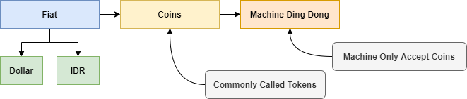
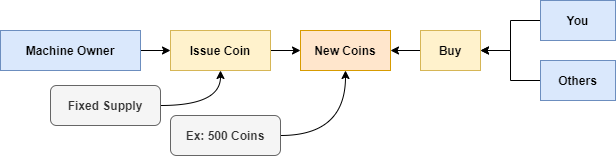
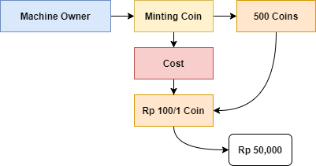
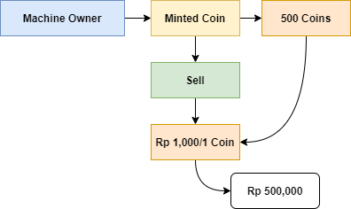
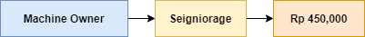
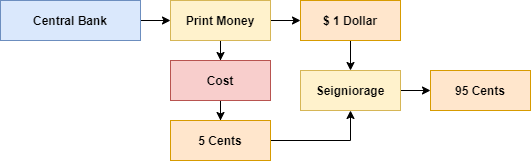
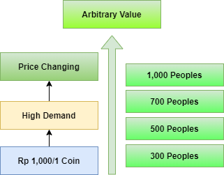

# Belajar Dengan Jenius Tokenomics

## Published 2021

## Penulis : Gun Gun Febrianza

# Cookbook

# Token

Untuk anak 90an ke bawah kalian pasti tau, kalau kita main ke sebuah **supermall** terdapat banyak sekali games yang bisa kita coba. Salah satunya adalah mesin ding dong, untuk menggunakannya kita perlu membeli sebuah koin agar kita dapat menggunakan mesin ding dong.

**Token** diciptakan sebagai alat pembayaran (**medium of exchange**) untuk membeli suatu barang atau jasa. Pada kasus mesin ding dong kita dapat menggunakan token untuk menikmati jasa **games** di **supermall**.

## Token Creation

Disini **Machine Owner** dapat menerbitkan atau mencetak koin sebanyak mungkin, jumlahnya koin yang dicetak dibatasi oleh jumlah mesin ding dong, luas tempat dan asumsi jumlah pelanggan yang akan datang. Pada kasus di bawah ini pemilik mesin memutuskan untuk mencetak **fixed supply** sebesar 500 **coins** : 

**Machine Owner** selanjutnya akan mencetak **500 coins**.

## Seigniorage

Saat **Machine Owner** akan mencetak uang, terdapat biaya yang dibutuhkan untuk setiap **coin**. Pada kasus ini **Machine Owner** memerlukan biaya sebesar 100 rupiah/koin, untuk itu total biaya yang dibutuhkan untuk membuat 500 **coins** adalah Rp 50.000,00 :

Kini setelah **Machine Owner** mencetak 500 **coins** selanjutnya dia dapat menjualnya dengan harga yang subjektif. 

Jika **Machine Owner** menjualnya sebesar 1.000 rupiah/koin, maka dia mendapatkan keuntungan dari penciptaan **token** sebesar 450.000 Rupiah. Gagasan **Seigniorage** menegaskan bahwa uang diciptakan tidak sesuai dengan nilainya, **Seignorage** adalah selisih dari nilai **token** dan biaya untuk pembuatan **token**.

Konsep **Seigniorage** juga berlaku untuk bank sentral, di amerika biaya untuk membuat satu dollar sebesar 5 **cents**. Pemerintah amerika mendapatkan keuntungan sebesar 95 **cents** yang akan digunakan untuk membantu beban pengeluaran negara, alternatif selain pajak.

## Supply & Demand

Jika terdapat permintaan di bawah 500 orang **Machine Owner** dapat mendistribusikan penjualan dengan harga 1,000 rupiah/koin. Jika saat pembukaan mesin ding dong ternyata terdapat banyak sekali permintaanya (**Demand**) dibandingkan ketersediaanya (**Supply**), maka harga **coin** tersebut bisa meningkat. 

Jika terdapat permintaan dari 1,000 orang maka terdapat pristiwa **high demand**, jumlah **coin** yang terbatas harganya akan meningkat sesuai dengan permintaan. Pristiwa ini juga merepresentasikan kenapa harga **bitcoins** bisa menjadi sangat mahal, karena terdapat permintaan melebihi jumlah ketersediaan unit **bitcoins** itu sendiri.

Terdapat banyak sekali skenario disini, salah satunya jika terdapat 1,000 orang yang melakukan permintaan masing-masing 1 koin maka **Machine Owner** dapat meningkatkan harga jual coin sebesar 1.500 rupiah/koin. Jika masih terdapat permintaan melebihi ketersediaan **Machine Owner** dapat terus menerus meningkatkan harga jual **coin**.

Machine Owner da

## Non-Fungible Token

Terminologi **Non-Fungible** artinya unik. **Non-Fungible Token** selanjutnya kita sebut **NFT** adalah sebuah aset digital yang keotentikannya mengandalkan **blockchain**. 

