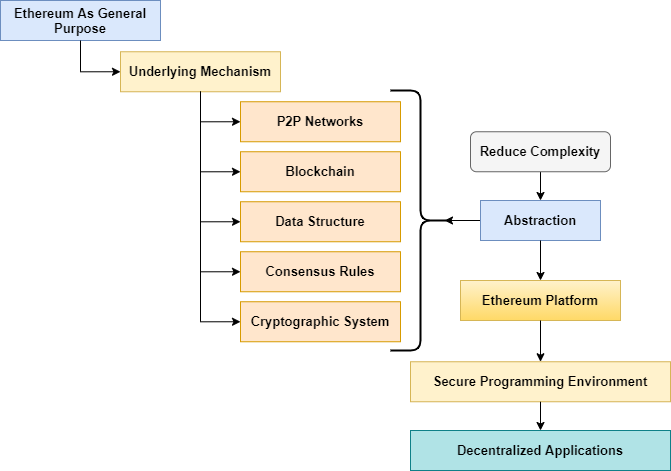
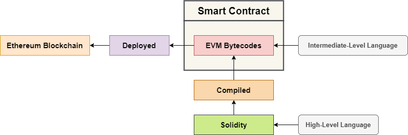

Belajar Dengan Jenius Tokenomics

## 

# Content Tables

- [Ethereum](https://github.com/gungunfebrianza/Belajar-Dengan-Jenius-Tokenomics/blob/main/ebooks/id/Ethereum.md#ethereum)

  - Open Source
  - Public Blockchain
  - [Turing Complete](https://github.com/gungunfebrianza/Belajar-Dengan-Jenius-Tokenomics/blob/main/ebooks/id/Ethereum.md#turing-complete)
  - [Smart Contract](https://github.com/gungunfebrianza/Belajar-Dengan-Jenius-Tokenomics/blob/main/ebooks/id/Ethereum.md#smart-contract)
  - [General Purpose](https://github.com/gungunfebrianza/Belajar-Dengan-Jenius-Tokenomics/blob/main/ebooks/id/Ethereum.md#ethereum)
  - [Current Problem State](https://github.com/gungunfebrianza/Belajar-Dengan-Jenius-Tokenomics/blob/main/ebooks/id/Ethereum.md#current-problem-state)

- [Ethereum Architecture](https://github.com/gungunfebrianza/Belajar-Dengan-Jenius-Tokenomics/blob/main/ebooks/id/Ethereum.md#ethereum-architecture)

  - [P2P Network](https://github.com/gungunfebrianza/Belajar-Dengan-Jenius-Tokenomics/blob/main/ebooks/id/Ethereum.md#p2p-network)
  - [Node](https://github.com/gungunfebrianza/Belajar-Dengan-Jenius-Tokenomics/blob/main/ebooks/id/Ethereum.md#node)
  - [Full Node](https://github.com/gungunfebrianza/Belajar-Dengan-Jenius-Tokenomics/blob/main/ebooks/id/Ethereum.md#full-node)
  - [Lighweight Node](https://github.com/gungunfebrianza/Belajar-Dengan-Jenius-Tokenomics/blob/main/ebooks/id/Ethereum.md#lightweight-node)
  - [Miners](https://github.com/gungunfebrianza/Belajar-Dengan-Jenius-Tokenomics/blob/main/ebooks/id/Ethereum.md#miners)
  - [Blocks](https://github.com/gungunfebrianza/Belajar-Dengan-Jenius-Tokenomics/blob/main/ebooks/id/Ethereum.md#blocks)
  - [EVM (Ethereum Virtual Machine)](https://github.com/gungunfebrianza/Belajar-Dengan-Jenius-Tokenomics/blob/main/ebooks/id/Ethereum.md#evm-ethereum-virtual-machine)
  - [Ether](https://github.com/gungunfebrianza/Belajar-Dengan-Jenius-Tokenomics/blob/main/ebooks/id/Ethereum.md#ether)
  - [Gas](https://github.com/gungunfebrianza/Belajar-Dengan-Jenius-Tokenomics/blob/main/ebooks/id/Ethereum.md#gas)
    - [Gas Limit](https://github.com/gungunfebrianza/Belajar-Dengan-Jenius-Tokenomics/blob/main/ebooks/id/Ethereum.md#gas-limit)
    - [Gas Price](https://github.com/gungunfebrianza/Belajar-Dengan-Jenius-Tokenomics/blob/main/ebooks/id/Ethereum.md#gas-price)
    - [Example](https://github.com/gungunfebrianza/Belajar-Dengan-Jenius-Tokenomics/blob/main/ebooks/id/Ethereum.md#example)

  - [Account](https://github.com/gungunfebrianza/Belajar-Dengan-Jenius-Tokenomics/blob/main/ebooks/id/Ethereum.md#accounts)
  - [ETH Blockchain Explorer](https://github.com/gungunfebrianza/Belajar-Dengan-Jenius-Tokenomics/blob/main/ebooks/id/Ethereum.md#eth-blockchain-explorer)

- Ethereum Virtual Machine (EVM)

- Smart Contract

- [Development Tools](https://github.com/gungunfebrianza/Belajar-Dengan-Jenius-Tokenomics/blob/main/ebooks/id/Ethereum.md#development-tools)

  - [Metamask](https://github.com/gungunfebrianza/Belajar-Dengan-Jenius-Tokenomics/blob/main/ebooks/id/Ethereum.md#metamask)
  - [Truffle](https://github.com/gungunfebrianza/Belajar-Dengan-Jenius-Tokenomics/blob/main/ebooks/id/Ethereum.md#truffle)
  - [Ganache](https://github.com/gungunfebrianza/Belajar-Dengan-Jenius-Tokenomics/blob/main/ebooks/id/Ethereum.md#ganache)
  - [Solidity Compiler](https://github.com/gungunfebrianza/Belajar-Dengan-Jenius-Tokenomics/blob/main/ebooks/id/Ethereum.md#solidity-compiler)
    - Node.js
  - [Remix](https://github.com/gungunfebrianza/Belajar-Dengan-Jenius-Tokenomics/blob/main/ebooks/id/Ethereum.md#remix)
    - [Runtime Environment](https://github.com/gungunfebrianza/Belajar-Dengan-Jenius-Tokenomics/blob/main/ebooks/id/Ethereum.md#runtime-environment)
    - Remixd
  - [Visual Studio Code (VSC)](https://github.com/gungunfebrianza/Belajar-Dengan-Jenius-Tokenomics/blob/main/ebooks/id/Ethereum.md#visual-studio-code-vsc)

- [Solidity](https://github.com/gungunfebrianza/Belajar-Dengan-Jenius-Tokenomics/blob/main/ebooks/id/Ethereum.md#solidity)

  - [High-level Language](https://github.com/gungunfebrianza/Belajar-Dengan-Jenius-Tokenomics/blob/main/ebooks/id/Ethereum.md#high-level-language)
  - [Object-oriented Language](https://github.com/gungunfebrianza/Belajar-Dengan-Jenius-Tokenomics/blob/main/ebooks/id/Ethereum.md#object-oriented-language)
  - [Statically Typed Language](https://github.com/gungunfebrianza/Belajar-Dengan-Jenius-Tokenomics/blob/main/ebooks/id/Ethereum.md#statically-typed-language)
  - [Case-sensitive Language](https://github.com/gungunfebrianza/Belajar-Dengan-Jenius-Tokenomics/blob/main/ebooks/id/Ethereum.md#case-sensitive-language)
  - [Turing Complete Language](https://github.com/gungunfebrianza/Belajar-Dengan-Jenius-Tokenomics/blob/main/ebooks/id/Ethereum.md#turing-complete-language)

- [Solidity Anatomy](https://github.com/gungunfebrianza/Belajar-Dengan-Jenius-Tokenomics/blob/main/ebooks/id/Ethereum.md#solidity-anatomy)

  - [SPDX License Identifier](https://github.com/gungunfebrianza/Belajar-Dengan-Jenius-Tokenomics/blob/main/ebooks/id/Ethereum.md#spdx-license-identifier)
  - [Pragma](https://github.com/gungunfebrianza/Belajar-Dengan-Jenius-Tokenomics/blob/main/ebooks/id/Ethereum.md#pragma)
    - [Semantic Versioning](https://github.com/gungunfebrianza/Belajar-Dengan-Jenius-Tokenomics/blob/main/ebooks/id/Ethereum.md#semantic-versioning)
  - [Import](https://github.com/gungunfebrianza/Belajar-Dengan-Jenius-Tokenomics/blob/main/ebooks/id/Ethereum.md#import)
  - [Contract](https://github.com/gungunfebrianza/Belajar-Dengan-Jenius-Tokenomics/blob/main/ebooks/id/Ethereum.md#contract)
    - Derived Contract
  - [State Variable](https://github.com/gungunfebrianza/Belajar-Dengan-Jenius-Tokenomics/blob/main/ebooks/id/Ethereum.md#state-variables)
    - [Visibility Specifier](https://github.com/gungunfebrianza/Belajar-Dengan-Jenius-Tokenomics/blob/main/ebooks/id/Ethereum.md#visibility-specifier)
    - [Constant & Immutable](https://github.com/gungunfebrianza/Belajar-Dengan-Jenius-Tokenomics/blob/main/ebooks/id/Ethereum.md#constant--immutable)
  - [Local Variable](https://github.com/gungunfebrianza/Belajar-Dengan-Jenius-Tokenomics/blob/main/ebooks/id/Ethereum.md#local-variable)
  - [Function](https://github.com/gungunfebrianza/Belajar-Dengan-Jenius-Tokenomics/blob/main/ebooks/id/Ethereum.md#function)
  - [Constructor](https://github.com/gungunfebrianza/Belajar-Dengan-Jenius-Tokenomics/blob/main/ebooks/id/Ethereum.md#constructor)
  - Modifier
  - Event
  - Collections

- [Types](https://github.com/gungunfebrianza/Belajar-Dengan-Jenius-Tokenomics/blob/main/ebooks/id/Ethereum.md#types)

  - [Strongly-typed](https://github.com/gungunfebrianza/Belajar-Dengan-Jenius-Tokenomics/blob/main/ebooks/id/Ethereum.md#strongly-typed)
  - [Dynamically-typed](https://github.com/gungunfebrianza/Belajar-Dengan-Jenius-Tokenomics/blob/main/ebooks/id/Ethereum.md#dynamically-typed)
  - [Why Solidity Strongly-typed?](https://github.com/gungunfebrianza/Belajar-Dengan-Jenius-Tokenomics/blob/main/ebooks/id/Ethereum.md#why-solidity-strongly-typed)
  - [Data](https://github.com/gungunfebrianza/Belajar-Dengan-Jenius-Tokenomics/blob/main/ebooks/id/Ethereum.md#data)
  - [Data Types](https://github.com/gungunfebrianza/Belajar-Dengan-Jenius-Tokenomics/blob/main/ebooks/id/Ethereum.md#data-types)
  - Solidity Types
  - [Value Types](https://github.com/gungunfebrianza/Belajar-Dengan-Jenius-Tokenomics/blob/main/ebooks/id/Ethereum.md#value-types)
  - [Reference Types](https://github.com/gungunfebrianza/Belajar-Dengan-Jenius-Tokenomics/blob/main/ebooks/id/Ethereum.md#reference-types)
    - Array
    - Struct
  - Mapping Types

- Web3.js

- DApps

  

# Ethereum

**Bitcoin** dibangun dengan tujuan yang spesifik yaitu **P2P electronic cash payment**. **Bitcoin** juga menyediakan **scripting language** dalam protokolnya, namun terdapat batasan fungsionalitas untuk scripting pada protokol **bitcoin**. Menulis **script** yang kompleks dalam **bitcoin scripting** sangat sulit karena **bitcoin scripting** tidak **Turing Complete**. 

Demi alasan keamanan (**security**) **scripting** yang disediakan dalam **bitcoin** tidak bersifat **Turing Complete**. **Turing Completeness** mengacu pada kemampuan suatu bahasa pemrograman untuk memecahkan permasalahan komputasi mulai dari program yang sederhana hingga program yang kompleks.

Berdasarkan permasalahan di atas **Vitalik Buterin** membangun protokol **Ethereum** akhir tahun 2013 dan **production** pertama di rilis tahun 2015. Sebuah protokol yang didesain **Open Source**, **Public Blockchain**, **General Purpose** dan dukungan pembuatan **Smart Contract** melalui bahasa pemrograman yang sudah mendukung **Turing Complete**.


## Open Source

**Open Source** artinya **Source Code Ethereum** bersifat terbuka, siapapun bisa ikut terjun untuk mengembangkannya bersama komunitas. Setiap pengembangan yang dilakukan para kontributor akan di **review** oleh komunitas jika mayoritas suara merasa inovasi yang dikembangkan memiliki **Value Proposition** yang bagus.

## Public Blockchain

**Blockchain** pada protokol **Ethereum** bersifat transparan secara penuh, siapapun dapat mendapatkan dan melihat isinya melalui **Blockchain Explorer** yang telah disediakan oleh komunitas. **Public Blockchain** juga memberikan makna bahwa setiap entitas dalam protokol **Ethereum** akan mendapatkan perlakuan yang sama dan setara.

## Turing Complete

Terminologi **Turing** diambil dari nama seorang figur dalam dunia **Computer Science**, yaitu **Alan Turing**. **Turing Complete** artinya kita dapat membuat **program** yang rumit dalam **Protokol Ethereum**, namun dengan catatan tingkat kompleksitas juga linear dengan resiko keamananya (**Complexity**-**Security Problem**). 

Karena itu sifat **Turing Complete** yang secara natural memiliki kekurangan yaitu program tidak bisa diprediksikan kalau tidak dieksekusi dulu (**termination** & **infinity loop problem**). Maka digagaslah konsep **Gas** dalam **Ethereum** sebagai mekanisme keamanannya, setiap intruksi dibebankan biaya sehingga **Smart Contract** memiliki batasan. 

**Gas** adalah sebuah solusi yang jenius, gas adalah konsep **metering mechanism** yang dapat digunakan untuk membatasi komputasi **Smart Contract**.

Kaum antagonis dapat memanfaatkan karakteristik **Turing Complete** yang dapat menimbulkan **infinite loops** pada **program smart contract** untuk menulis **malicious program (Malware)** atau bisa juga terjadi karena **Human-error** yang dilakukan secara tidak sengaja.


Pembangunan bahasa pemrograman yang bersifat **Turing Complete** untuk **Ethereum Virtual Machine (EVM)** pada protokol **Ethereum** pertama kali di gagas oleh **Gavin Wood** pada tahun 2014. Selanjutnya pengembangan **Project Solidity** dipimpin oleh **Christian Reitwiessner**. 

## Smart Contract

Pada **Ethereum** jika ingin membuat **Smart Contract**, kita dapat menulisnya menggunakan bahasa pemrograman **Solidity**. **Smart Contract** yang telah ditulis harus dikompilasi kedalam bahasa **Intermediate Level** yang disebut dengan **EVM Bytecode** agar dapat berjalan dalam **Ethereum Virtual Machine (EVM)**.

 

Dengan dukungan **Turing Complete**, **Ethereum Virtual Machine (EVM)** dapat melakukan komputasi seluruh algoritma dari setiap program **Smart Contract** yang tertanam dalam **Ethereum Blockchain**.


Setiap **Smart Contract**, memiliki **Contract Address** dan untuk menjalankan sebuah **Smart Contract** diseluruh **Node** kita harus melakukan sebuah **Transaction**. Sebuah **Transaction** dapat digunakan untuk memanggil fungsi tertentu dalam **Smart Contract**, atau memberikan input data pada **Smart Contract** untuk mengubah **State** di dalamnya.


State yang diubah oleh **Smart Contract** pada **Ethereum Blockchain** ketika telah disetujui oleh **miner** akan menimbulkan perubahan pada **Global State Machine**, ketika perubahan **state** berhasil dilakukan maka seseorang yang melakukan **transaction** telah melakukan **Global State Transation**.

**Ethereum** adalah sebuah **Distributed State Machine** yang tidak hanya melacak **state** setiap **currency ownersip** seperti dalam protokol **Bitcoin**. **Ethereum** juga melacak **arbitraty state transition** yang dapat digunakan untuk menyimpan berbagai data, kita dapat menyimpan sebuah data dengan struktur data **key-value**.

**Ethereum** menyediakan sebuah **memory** untuk menyimpan sebuah program yang terdiri dari **code** dan **data**, **program** dapat dimuat ke dalam **State Machine**, untuk dieksekusi dan menyimpan hasil **State Changes** ke dalam **Ethereum Blockchain**. **State Transition** di setiap **nodes** di proses oleh **Ethereum Virtual Machine (EVM)**.

## General Purpose

**Ethereum** sebagai **General Purpose** artinya para **Founder Ethereum** berpikir bagaimana caranya sekumpulan aplikasi dapat diprogram untuk di tanam ke dalam **Blockchain**. Bagaimana aplikasi tersebut dapat dibuat tanpa perlu melakukan skema **Reinventing The Wheels**, tanpa perlu memahami kerumitan protokol sebuah **Cryptocurrency**.



**Ethereum Platform** harus bisa menyediakan sebuah lingkungan yang dapat digunakan untuk membangun aplikasi terdesentralisasi (**DApps**) dengan output **Deterministic**. Menyediakan sebuah lingkungan yang dapat digunakan membuat **DApps** dengan mudah tanpa perlu memahami kerumitan protokol **Cryptocurrency**.

## Current Problem State

Transaksi dalam **public blockchain** seperti **bitcoin** dan **ethereum** masih lamban, problema **high throughput transaction** masih belum bisa diselesaikan. Transaksi dalam protokol **Bitcoin** rata-rata diproses sekitar 10 menit sekali dan para protokol **Ethereum** rata-rata 15 detik.

**Mainframe Computing** masih menjadi **champion** dalam dunia transaksi keuangan, **Mainframe Computer** seperti **IBM z13** memiliki kapabilitas untuk memproses **2.5 billion transaction/day** dan **IBM z15** memiliki kapabilitas untuk memproses **1 trillion web transaction/day.**

Saat ini kemampuan maksimum transaksi yang dapat dilakukan pada protokol **Ethereum** sebesar 1,4 juta transaksi/perhari dan pada protokol **Bitcoin** sekitar 300.000 transaksi/perhari. Beberapa solusi yang sedang dikembangkan saat ini adalah :

1. **Ethereum** masih berjalan seperti **Single-threaded Computer**, memproses satu transaksi dalam satu waktu. Sehingga sharding pada **blockchain** dapat membantu meningkatkan performance seperti **Multithreaded Computer**.
2. Solusi **Layer 2**, seperti **Plasma** dan **State Channel** mendukung **Off-chain Transaction** dengan kecepatan transaksi mendekati **realtime**. Transaksi ini akan dikirim menuju **Main Chain** secara periodik. Pada protokol **Bitcoin** terdapat **Lightning Network** untuk mendukung **Off-chain Transaction**.

# Ethereum Architecture

Terdapat berbagai entitas di dalam jaringan **Ethereum**, mulai dari **Miners**, **Full Nodes** hingga pengguna **Lightweight Nodes**. Setiap **Nodes** terhubung secara **P2P** (**Peer-to-Peer**) dan setiap **Nodes** selain **Lightweight Nodes** memiliki salinan secara penuh **Ethereum Blockchain**. 


Salah satu **Ethereum Client** yang saat ini aktif dikembangkan adalah **Geth**.

## P2P Network

Dalam jaringan **P2P** terdapat dua atau lebih komputer yang terhubung untuk berbagi **resources** tanpa harus mengandalkan sistem yang tersentral.

## Node

**Node** adalah setiap perangkat komputer yang terhubung ke dalam jaringan **Ethereum**. Setiap **Node** memiliki salinan terbaru dari **Ethereum Blockchain** secara aktual selama terhubung ke internet. Setiap **Node** dapat melakukan transaksi secara independen. 

Terdapat tiga tipe **Node** :

- **Full Node**
- **Lightweight Node**
- **Miners**

## Full Node

**Full Node** akan menyalin seluruh data **Ethereum Blockchain** terbaru dan berpartisipasi dalam kegiatan memverifikasi setiap **block** dan transaksi sesuai dengan **Consensus Mechanism** yang digunakan.

## Lightweight Node

**Lightweight Node** adalah **node** yang tidak menyimpan seluruh salinan data **Ethereum Blockchain**. **Lightweight Node** hanya digunakan untuk memverifikasi transaksi menggunakan metode **Simple Payment Verification (SPV)**. Metode ini digunakan untuk memverifikasi apakah suatu transaksi sudah tertanam dalam ethereum blockchain atau belum.

Dengan metode **Simple Payment Verification (SPV)** verifikasi dapat dilakukan tanpa perlu menyalin seluruh data **Ethereum Blockchain**, **lightweight node** hanya menyimpan seluruh data **header information** dalam suatu **blocks** sebagai solusi untuk mengurangi penyimpanan data **blockchain** yang ukurannya sangat besar.

## Miners

**Miners** adalah **node** yang memberikan kontribusi **storage** dan **computation power** sebagai **resources** untuk mengeksekusi **consensus mechanism** untuk memverifikasi transaksi dalam protokol **ethereum**. Sebagai gantinya terdapat insentif yang akan mereka dapatkan yaitu :

1. **Block Reward** dan 
2. **Transaction Fees** dari setiap transaksi

## Blocks

**Blockchain** adalah serangkaian **block** dan setiap **block** baru yang dibuat saling terhubung dengan **block** sebelumnya, di dalam setiap **block** terdapat **block header** dan sekumpulan transaksi. **Block** yang pertama kali dibuat disebut dengan genesis **block**. 


Setiap **block header** menyimpan **metadata** berupa informasi terkait data **block** sebelumnya. Ada banyak sekali **properties** dalam **block header** namun kita cukup memahami beberapa **properties** yang relevan saja untuk memahami proses **block generation** :


### Parent Hash 

Informasi **hash** terkait **block** sebelumnya disebut dengan **parent block**, setiap **block header** akan menyimpan parent hash sampai **block** yang tidak memiliki nilai **parent hash** di paling ujung yaitu **genesis block**.

### Nonce 

Sebuah **number** yang ditemukan oleh **miners** untuk memecahkan **cryptographic puzzle**.

### Receipt Roots 

Sebuah **Keccak 256-bit hash** dari **root node** dalam **tree data structure**.

### Timestamp 

Waktu saat **blockchain** diproduksi dan disimpan ke dalam **Ethereum Blockchain**.

### Transaction Root 

Sebuah **Keccak 256-bit hash** dari **root node** dalam **tree data structure** yang ada di dalam setiap transaksi.

### State Root

Sebuah **Keccak 256-bit hash** dari **root node** dalam **state tree** setelah seluruh transaksi dieksekusi.

Pada protokol **Ethereum** setiap **block** diproduksi menggunakan **PoW Algorithm** yang diberi nama **Ethash**. **Block** terbaru akan diproduksi dengan interval waktu rata-rata 15 detik.


## EVM (Ethereum Virtual Machine)

**Ethereum Virtual Machine (EVM)** adalah sebuah **Runtime Engine** untuk mengeksekusi program **Smart Contract** yang telah dikompilasi kedalam **EVM Bytecodes**, yang disebut dengan **Opcode**. Selanjutnya **Opcode** harus di **deploy** pada **Ethereum Blockchain** agar dapat digunakan.



Terdapat beberapa bahasa pemrograman **high-level** yang dapat digunakan untuk membuat sebuah **Smart Contract** :


Pengembangan **LLL**, **Serpent** dan **Bamboo** sudah mulai jarang, pengembangan **Solidity** dan **Vyper** masih aktif dan intens saat buku ini ditulis.

## Ether

Mata uang dalam **Ethereum** di sebut dengan **Ether** dengan simbol **ETH**. **Ether** bersifat **fungible** yang dapat dibagi kedalam **unit** terkecil dengan maksimum 18 digit, 1 **Ether** (**ETH**) dapat direcah kedalam unit terkecil yang di sebut dengan **wei**. 1 **Ether** merepresentasikan 1 **Quintillion Wei** (1,000,000,000,000,000,000).


Secara internal, **value ether** direpresentasikan dalam **unsigned integer wei**. Setiap transaksi yang dilakukan dalam protokol **Ethereum** memerlukan sebuah biaya berupa **gas** yang harus dibeli menggunakan **Ether**. Biaya tersebut selanjutnya akan menjadi insentif untuk para **miners**.

## Gas

Sebelumnya kita telah memahami bahwa gas digunakan sebagai **metering mechanism** agar dapat membangun program **smart contract** yang aman dengan dukungan **turing complete**. **Gas** juga digunakan sebagai biaya dalam setiap transaksi untuk skema insentif untuk para **miners**.


Setiap **Block** dalam **Ethereum** juga dibatasi untuk setiap transaksinya dengan jumlah 8 juta **Gas**. **Ethereum** akan merekomendasikan seberapa besar **Gas Fee** yang diperlukan untuk melakukan transaksi. **Gas** hanya dapat dibeli menggunakan **ether**.


Saat kita melakukan transaksi pada protokol **Ethereum**, kita dapat menentukan **Gas Price** dan **Gas Limit** setelah mendapatkan bantuan rekomentasi dari protokol **Ethereum**. 

### Gas Limit

**Gas Limit** adalah prediksi maksimum jumlah **Gas** yang diperlukan untuk melakukan transaksi, jika pada akhirnya jumlah **Gas** yang dikonsumsi lebih sedikit maka sisa **Gas** akan dikembalikan lagi pada pemiliknya. Jika jumlah **Gas** yang diperlukan tidak mencukupi maka transaksi akan gagal, lengkap dengan kerugian kehilangan **Gas**.

### Gas Price

Gas Price adalah harga untuk setiap unit **Gas** yang harus dibayar agar transaksi dapat dilakukan. Jumlah **Gas Price** diukur dalam satuan **Gwei**, jika kita memberikan **Gas Price** yang tinggi maka transaksi akan lebih diprioritaskan untuk dieksekusi oleh **miners**. Jika **Gas Price** rendah maka transaksi akan kurang diprioritaskan.

### Example

Pada kasus di bawah ini jika kita memiliki **0.1 ETH** maka, maksimum **ETH** yang dapat dikirimkan sebesar **0,09995 ETH** dikarenakan terdapat **Gas Fee** yang diperlukan untuk mengirimkan **0,09995 ETH** . Saat buku ini ditulis **Ethereum** merekomendasikan **Gas Limit** sebesar **31.582** dan **Gas Price** sebesar **1,5986** **Gwei**. 

Jika **Gas Limit** dan Gas Price dikalikan jumlahnya adalah **50.486,9852 Gwei**, selanjutnya jika **50.486,9852 Gwei** dikonversikan kedalam **Ether** maka totalnya adalah **0,00005 ETH**. Inilah alasan kenapa saat itu penulis hanya dapat mengirimkan **ETH** maksimum sebesar **0,09995 ETH**, karena **0,00005 ETH** harus digunakan sebagai **Gas Fee**.


Jumlah **Gas** telah ditetapkan secara **Fixed** untuk setiap operasi **Bytecode** dalam **Smart Contract** yang dieksekusi di dalam **Ethereum Virtual Machine (EVM)** 


Setiap **block** telah di **hardcode** menyediakan batasan **Gas Limit** sekitar 8 juta **gas** per **block**. Ini artinya total **gas** yang digunakan dalam setiap transaksi pada suatu **block** tidak dapat melebihi 8 juta **gas** per **block**.

## Accounts

**Bitcoin** menggunakan terminologi **Address** sementara **Ethereum** menggunakan terminologi **Account**. Setiap **Ethereum** **Accounts** dapat memiliki sekumpulan **Addresses**. Selain itu dalam protokol **Ethereum** terdapat dua **Accounts** yang dapat dibuat dalam Protokol **Ethereum** :


Masing-masing **Account Address** dalam **format Hexadecimal**, dengan **prefix** awalan **0x**. Di bawah ini adalah contoh **EOA Account** **address** milik penulis :


0x39a641896C95e463B77b3C3cc92A55Cc5cF93882

## ETH Blockchain Explorer

Untuk mengeksplorasi **blockchain explorer** pada protokol **Ethereum** anda bisa mengunjungi :

etherscan.io

Jika anda ingin memahami status **Ethereum Network** secara **realtime** dengan tampilan **user interfaces** yang menarik silahkan kembangkan **ETH Netstat**. **Download source code** disini 

```
git clone https://github.com/cubedro/eth-netstats
```

**Install dependencies** :

```
sudo npm install -g grunt-cli
cd eth-netstats
npm install
```

**Build Project** :

```
grunt
npm start
```

# Ethereum Virtual Machine (EVM)

# Smart Contract

**Smart Contract** dalam jaringan **Ethereum** tidak dieksekusi secara **parallel**. **Ethereum** adalah **world computer** yang mekanisme eksekusinya berbasis **Single-threaded**.


# Development Tools

Kita dapat membuat **Smart Contract** pada Protokol **Ethereum** dengan memanfaatkan **Javascript API** dalam **Web3.js**, terdapat sebuah **function** yang memfasilitasi untuk membuat sebuah **Smart Contract**. Nama dari **function** tersebut adalah [web3.eth.Contract](https://web3js.readthedocs.io/en/1.0/web3-eth-contract.html#new-contract).

## Metamask 

**Metamask** adalah sebuah **Ethereum Wallet** di dalam **browser**, kini sudah menyediakan dukungan untuk **browsers Firefox** dan **Chrome**.

## Truffle

Pengembangan **Smart Contract** untuk protokol **Ethereum**.

## Ganache

Untuk membuat **Ethereum Network** sebagai lingkungan untuk melakukan simulasi **development**, kita dapat menggunakan **ganache-cli**. Dengan **ganache-cli** kita dapat membangun **Personal Blockchain Network** untuk **development** dalam **Ethereum Protocol**.

Selain versi **command-line ganache** juga menyediakan versi GUI (**Graphic User Interface**) untuk mempermudah para pemula untuk mempelajarinya.

## Solidity Compiler 

### Node.js

**Node.js** menyediakan **binding** untuk **Solidity Compiler** melalui **package solc-js**, untuk instalasi eksekusi perintah di bawah ini :

```
npm install -g solc
```


## Remix

**Remix** adalah **Open-source IDE** untuk melakukan **Coding**, **Compiling**, **Testing** dan **Debugging** sebuah **Smart Contract** yang ditulis menggunakan **Solidity**. **Remix** adalah **browser-based development environment** yang memberikan fitur lengkap untuk para **Smart Contract Developer**.

### Runtime Environment


### Remixd

**Remix** juga menyediakan **Node.js Package** yang dapat kita gunakan agar **Remix** dapat berinteraksi dengan **Filesystem** dalam sistem operasi kita untuk melakukan operasi **read & write**. Fitur ini membantu kita agar tidak perlu menyalin kode pada **Filesystem** ke dalam **Remix** secara manual.

```
npm install -g @remix-project/remixd
```

## Visual Studio Code (VSC)

**Visual Studio Code (VSC)** juga mendukung pengembangan **Solidity** melalui **Extension** yang telah disediakan komunitas dalam **Visual Studio Marketplace**. **Extension Solidity** yang terbaik dalam opini penulis saat ini pada **VSC** di tulis oleh **Juan Blanco**.

# Solidity

**Solidity** adalah bahasa pemrograman yang dikembangkan oleh **Gavin Wood**, **Christian Reitwiessner**, **Alex Beregszaszi** dan **Ethereum Contributor** lainnya. Bahasa pemrograman **solidity** dipengaruhi oleh bahasa pemrograman **C++**, **Javascript** dan **Python**.


Di bawah ini adalah **Lifecyle** yang akan dilakukan seorang **Smart Contract Developer**, pertama dia akan menulis sebuah **Smart Contract**, melakukan **Testing Smart Contract**, melakukan proses **Deployment Smart Contract** pada **Test Net** atau **Main Net** dan mengeksekusi **Smart Contract**.


## High-level Language

**Solidity** adalah bahasa pemrograman tingkat tinggi (**High-level Language**) yang artinya bahasa pemrograman bersifat mudah difahami (**human-readable**). Solidity adalah bahasa pemrograman high-level seperti bahasa high-level lainnya yaitu **Go**, **C++**, dan **Java**.


Perbedaanya adalah hasil kompilasi pada **Solidity**, output kompilasi nerupa **Intermediate Representation** (**IR**) yang disebut dengan **EVM Bytecode**. Selanjutnya **EVM Bytecode** akan dieksekusi di dalam **Ethereum Virtual Machine** (**EVM**) pada sebuah **Node Environment**.

Seperti yang telah kita pelajari sebelumnya **Smart Contract** yang telah di **deploy** ke dalam **Ethereum Blockchain** akan tersimpan diseluruh **Full Node** membentuk sebuah **Global State Machine**.


## Object-oriented Language

**Solidity** adalah bahasa pemrograman yang sudah mendukung paradigma **Object-oriented programming language** untuk meningkatkan produktivitas penulisan kode para pengembang. Dukungan Object-oriented pada versi 8.6.0 masih terbatas.

## Statically-Typed Language

**Solidity** adalah bahasa pemrograman dengan karakteristik **Statically Typed Language** artinya tipe data suatu **variable** harus didefinisikan terlebih dahulu dengan jelas. 


## Case Sensitive Language

Bahasa juga memiliki karakteristik **case-sensitive** sehingga mempengaruhi penulisan pemrograman dalam pembuatan sebuah **identifier**.


## Turing Complete Language

**Solidity** adalah bahasa pemrograman yang sudah **turing complete** yang dapat digunakan untuk menyelesaikan berbagai komputasi pemrograman mulai dari yang sederhana hingga kompleks. Dalam **solidity** terdapat dukungan seperti **inheritance**, **libraries** dan **complex user-defined types**.


# Solidity Anatomy

Di bawah ini adalah contoh **Solidity Anatomy** kita akan mengupasnya satu persatu :


## SPDX License Identifier

**Trust** ditandai dengan tersedianya **source code** yang terbuka, namun menyediakan **source code** yang terbuka artinya berhadapan dengan permasalahan legal terkait **copyright**. 

**Compiler** menegaskan penerapan **SPDX License Identifier**. **SPDX** (**Software Package Data Exchange**) harus diterapkan untuk setiap **file** dengan cara membuat komentar di baris awal **file solidity** yang mengindikasikan sebuah **license**, di bawah ini adalah contoh pemberian informasi **SPDX** :

```
**// SPDX-License-Identifier : MIT**
```

**Compiler** tidak akan memvalidasi apakah **license** bagian dari yang [diizinkan](https://spdx.org/licenses/) dalam **SPDX** atau tidak, namun akan menyimpannya kedalam **Contract Metadata / bytecode metadata**. Jika anda tidak ingin memberikan spesifikasi **license** atau **source code** karena  tidak bersifat **open source** maka gunakan **special value** **UNLICENSED**.

Informasi lebih lengkap terkait **SPDX License Identifier** dapat ditemui di [sini](https://spdx.org/ids-how).

## Pragma

**Keyword pragma** adalah sebuah **directive** untuk menentukan **compiler** yang akan digunakan dan menjalankan fitur-fitur tertentu dalam **compiler** yang akan digunakan untuk mengkompilasi **file solidity** saat ini. Di bawah ini adalah contoh **statement** penggunaan **pragma** :

```
pragma solidity ^0.8.6;
```

**Statement** di atas menegaskan **compiler** untuk melakukan **compilation** menggunakan **compiler versi 0.8.6** atau dengan **compiler** yang lebih tinggi dalam **semantic versioning 0.8.x**, sangat disarankan versi **solidity compiler** dikunci tanpa menggunakan notasi ^ atau simbol **caret**.

Hal itu dilakukan agar **Smart Contract** yang kita tulis tidak mengalami **output** yang tidak diharapkan (**unexpected behaviour**), karena setiap kali **compiler** terbaru dirilis terdapat bug dalam versi sebelumnya yang telah dibenahi sehingga dapat mempengaruhi **Smart Contract** yang telah kita tulis.

### Semantic Versioning

Pemilihan **compiler** menggunakan model **semver** yang terdiri dari 3 urutan yaitu :

1. **Major Version,** 
2. **Minor Version dan** 
3. **Patch** 

Jika kita menggunakan **Compiler** versi **0.8.6**, maka 0 adalah **Major Version**, 8 adalah **Minor Version** dan 6 adalah **Patch**. 

## Import

**Solidity** menyediakan **keyword import** agar bisa berinteraksi dengan **file solidity** lainnya. Tujuan dari **import** agar kode yang ditulis dengan **solidity** bisa lebih **modular**. Di bawah ini adalah contoh **statement** untuk melakukan **import** sebuah **file solidity** yang lokasinya berada dalam **current local directory** :

```
import “HelloWorld.sol”;
```

Kita dapat menggunakan seluruh **global symbol** dari **file** yang di **import** :

```
import * as MyContract from “BaseContract.sol”;
```

Atau menggunakan **alias** seperti pada contoh kode di bawah ini :

```
import “BaseContract.sol” as MyContract;
```

Jika kita tidak ingin menggunakan seluruh **global symbol** dari sebuah **file**, karena ingin menggunakan beberapa **symbol** saja anda dapat mempelajari contoh **statement** di bawah ini : 

```
import {symbol1 as alias, symbol2} from " BaseContract.sol";
```

Saat kita melakukan proses **Deployment Smart Contract**  ke dalam **Ethereum Blockchain**, **Import Statement** harus diganti dengan seluruh **file solidity** yang akan di **import**. Jika kita menggunakan **Development Tools** seperti **Truffle** atau **Remix** maka seluruh **file** yang di **import** akan dikonversi menjadi sebuah **file** tunggal yang **ready** untuk di **deploy**.

## Contract

**Contract** dalam **Solidity** mirip dengan konsep **Class** dalam **Object-oriented language**, seperti yang telah anda lihat pada diagram sebelumnya terdapat banyak sekali komponen yang dapat disisipkan pada sebuah **Contract**. Sebuah **Contract** memiliki pengenal (**identifier**).

Di bawah ini adalah contoh diagram sebuah **Contract** dalam **Solidity** :


Di bawah ini adalah contoh kode dua buah **Contract** dalam satu **file Solidity** :

```
// SPDX-License-Identifier: MIT
pragma solidity ^0.8.4;

contract myFirstContract {
    
}

contract mySecondContract {
    
}
```

### Derived Contract

Di bawah ini adalah contoh **Derived Contract**, terdapat **Child Contract** dan **Parent Contract** :

```
// SPDX-License-Identifier: MIT
pragma solidity ^0.8.4;

contract Parent {

}

contract Child is Parent {

}
```


## State Variables

**State Variables** adalah **variables** yang nilainya tersimpan secara **permanent** dalam **Contract Storage **dalam **Ethereum Blockchain**. Terminologi **State** digunakan untuk menjelaskan sebuah **variable** yang akan menjadi **state** dari **Smart Contract** itu sendiri. 

Ketika **Smart Contract** telah di **deploy** kedalam **Ethereum Blockchain**, **state** di dalamnya akan menjadi sebuah **Global State Machine**. Di bawah ini adalah diagram deklarasi **state variable** dengan tipe data **string** menggunakan **Solidity** : 


Diagram di atas jika dikonversi ke dalam contoh kode **Solidity** :

```
    string public hello = "Hello Maudy";
```

### Visibility Specifier

Terdapat 3 **Visibility Specifiers** yang dapat diterapkan pada sebuah **State Variable**, penerapan **Visibility Specifiers** akan memberikan karakteristik tersendiri pada **State Variable** :


Setiap **Visibility Specifiers** memiliki karakteristik tersendiri, secara **default state variable** yang tidak diberi **visibility** akan otomatis memiliki **visibility internal**. **Variable** dapat digunakan dalam **Contract** saat ini dan **Contract** turunannya. :


Pada **State Variable** dengan **Visibility Private** akan memberikan karakteristik yang membuat **Variable** hanya dapat digunakan pada lingkungan **Contract** saat ini dan tidak dapat diakses oleh **Contract** turunannya.

Pada **State Variable** dengan **Visibility Public** akan memberikan karakteristik yang membuat **Variable** dapat diakses secara langsung dan **Compiler** akan secara otomatis membuat sebuah **Getter Method**.

### Constant & Immutable

Sebuah **State Variable** juga dapat dideklarasikan sebagai sebuah **Constant** atau **Immutable**. Jika **Smart Contract** sudah di tanam ke dalam **Ethereum Blockchain** maka **State Variable** bersifat permanen tidak dapat diubah. Terdapat dua terminologi yang harus difahami yaitu :


**Literal Value** dari **Constant** harus ditentukan saat **Compile-time**, sementara **Immutable** ditetapkan pada **Construction Time**. Untuk memahami konsep tersebut perhatikan contoh kode **Solidity** di bawah ini :

```
contract C {
    string constant MAUDY = "Maudy Ayunda";
    bytes32 constant MY_HASH = keccak256("Perahu Kertas");
    uint immutable decimals;
    uint immutable maxBalance;
    address immutable owner = msg.sender;

    constructor(uint _decimals, address _reference) {
        decimals = _decimals;
        maxBalance = _reference.balance;
    }
}
```

Terdapat dua buah **State Variable** yang menjadi sebuah **Constant Variable** dan kita telah menetapkan **literal value** untuk dua buah **State Variable** tersebut, sehingga dapat diproses saat **Compile-time**. 

Pada **State Variable** dengan **immutable** kita akan memberikan nilainya pada saat proses **deployment** melalui **Constructor**. Nilai yang diberikan tidak bersifat **fixed** seperti **constant**, **literal value** yang diberikan pada **immutable variable** bersifat **Arbitrary**.

Note Gas : Sebagai catatan **Gas Cost** dari **Constant** dan **Immutable variable** biayanya lebih rendah. 

## Local Variable

Sebelumnya kita telah mempelajari **State Variable** yang secara permanent akan tersimpan dalam **Ethereum Blockchain**. **Local Variable** bekerja sebaliknya, bersifat **Volatile** karena lokasinya tersimpan dalam **Stack**. Sebuah **variable** yang di deklarasikan di dalam sebuah **Function** disebut sebagai **Local Variable**.

## Function

**Function** adalah sebuah **subprogram** yang didesain untuk menyelesaikan tugas spesifik. Sebuah **Function** dapat digunakan untuk membungkus sekumpulan **statement**, **expression**, atau **function** itu sendiri menjadi sebuah **object** tunggal. Tujuannya adalah **abstraction** dan **modularity** dengan karakteristik **High Cohesion** dan **Low Coupling**.  

Sebuah **Function** dapat memiliki **parameter** sebagai **input data** untuk diproses dan sebuah **Function** dapat memproduksi sebuah **Return** atau tidak sama sekali, proses pemanggilan **function** disebut dengan **Invoking**.  Di bawah ini adalah contoh diagram deklarasi sebuah **Function** :


Di bawah ini adalah contoh **function deposite** dalam **Solidity** :

```
    uint256 myfund;
    function deposite(uint256 amount) public {
        myfund = amount;
    }
```

Di bawah ini adalah contoh diagram **function** yang menggunakan **state mutability** dan **return** : 


Di bawah ini adalah contoh **function withdraw** dalam **Solidity** :

```
    function withdraw() public view returns (uint256){
        return myfund;
    }
```

## Constructor

Sebuah **Contract** dapat memiliki **Constructor** atau tidak sama sekali, sehingga **Constructor** bersifat **Optional**. Namun sebuah **Contract** hanya dapat memiliki satu **Constructor** saja dan bersifat **one-time execution**. Jika **Constructor** sudah dieksekusi dalam **Ethereum Blockchain** maka hasilnya akan tercatat secara permanen.

**Constructor** menentukan karakteristik **Smart Contract** saat pertama kali ditanam dalam **Ethereum Blockchain** jadi para **Smart Contract Developer** harus mempertimbangkannya dengan matang.

# Types

**Types** adalah sekumpulan nilai yang dikenali oleh **compiler** untuk mengatur bagaimana data harus digunakan. 

## Strongly-typed

Sebuah bahasa pemograman dikatakan **Strongly Typed** jika sebuah **Compiler** memproduksi **error** jika sebuah **type** digunakan dengan cara yang salah. **Solidity** sebagai bahasa pemrograman yang memiliki karakteristik **Statically-typed Language**, **state variable** atau **local variable** harus memiliki tipe data yang jelas terlebih dahulu.

Pada **Strongly Typed** terdapat nilai **correctness** dan **safety**, nilai **correctness** memberikan keunggulan dari segi **performance** dan nilai **safety** memberikan manajemen integritas data yang baik, pendeteksian **bug** dan kemungkinan **error** saat **runtime** yang lebih baik.

## Dynamically-typed

Jika sebelumnya anda sudah mempelajari bahasa pemrograman seperti **Python** dan **Javascript**, maka anda akan memahami **Loosely Typed Language** atau **Dynamic Typing**. Anda dapat membuat variabel tanpa harus menetapkan tipe data terlebih dahulu, baik itu berupa **literal number**, **string** ataupun **boolean logic**.

Sebuah bahasa dikatakan **Dynamically Typed** karena saat **runtime,** tipe data dapat diubah ke tipe data lainya agar program bisa berjalan sesuai instruksi. Pada **Dynamically Typed** terdapat **simplicity** dan **speed** untuk pengembangan **software**.

## Why Solidity Strongly-typed?

Dikarenakan kita akan membuat sebuah program **Smart Contract**, nilai **Safety** sangat penting sehingga paradigma bahasa pemrograman yang ideal untuk diterapkan untuk membuat **Smart Contract** adalah bahasa yang **Strongly-typed**. Itulah alasan kenapa bahasa pemrograman **Solidity** bersifat **Strongly-typed** :

Sebuah **types** menentukan :

1. Data seperti apa saja yang dapat disimpan? 

2. Seberapa besar memori yang dibutuhkan untuk menyimpan data?

3. Operasi apa saja yang dilakukan pada data tersebut?

## Data

**Data** dalam komputer secara **digital electronics** direpresentasikan dalam wujud **Binary Digits (bits)**, sebuah unit informasi (**unit of information**) terkecil dalam mesin komputer. Setiap *bit* dapat menyimpan satu nilai dari **binary number** yaitu **0 atau 1**, sekumpulan **bit** membentuk konstruksi *Digital Data**. 

Jika terdapat **8 bits** yang dihimpun maka akan membentuk **Binary Term** atau **Byte**. Pada **level byte** sudah membentuk unit penyimpanan (**unit of storage**) yang dapat menyimpan **Single Character**. Satu **data byte** dapat menyimpan 1 **character** contoh : **'A'** atau **'x'** atau **'$'**. 

Serangkaian **byte** digunakan untuk membuat **Binary Files**, pada **Binary Files** terdapat serangkaian **bytes** yang dibuat untuk merepresentasikan lebih dari sekedar **character** atau **text**. Pada **level** yang lebih tinggi (**kilobyte**, **megabyte**, **gigabyte** & **terabyte**) kumpulan **bits** ini dapat digunakan untuk merepresentasikan teks, gambar, suara & video.

## Data Types

**Data Types** adalah sebuah **set** yang memiliki :

**1.**  **Characteristic** 

Karakteristik yang dimilikinya adalah nama **keyword** dan ukuran memori yang digunakannya untuk menyimpan data.

*2.*  **Range** ***Value***

**Range Value** adalah jangkauan variasi nilai (**value**) yang dapat disimpan.

**3.**  **Type**

Mengacu pada **numeric** atau **symbolic**.

Seluruh **data types** dibuat dari sekumpulan **unit of memory** yang disebut dengan **byte**. Kita akan mengambil **case study** contoh **data types** dalam bahasa pemrograman **Solidity**, pada kasus ini yaitu **uint8** dan **int8** :


### Characteristic uint8

Sebagai contoh terdapat sebuah **data types** dengan karakteristik :

1. Bernama **uint8** (*uint* = *unsigned integer*) 

2. Ukuran memorinya sebesar 1 **byte** atau 8 **bits**.

Terminologi **Unsigned Integer** artinya kita hanya dapat menyimpan data **integer** positif saja, kita tidak bisa menyimpan data **integer** negatif. 

### Range Value uint8

Maka pada tipe data **uint8** kita bisa menampung **set of integer** dengan **range value** dari :

```
// SPDX-License-Identifier: MIT
pragma solidity ^0.8.4;

contract LearnSolidity {
    uint8 public maxValue = 255;
    uint8 public minValue = 0;
    uint8 public error1 = 256; <--- ERROR
    uint8 public error2 = -1; <---- ERROR
}
```

Kenapa bisa tipe data **uint8** dapat menyimpan nilai dengan jarak antara **minimum 0** dan **maximum 255** ?

Berdasarkan karakteristik ukuran memori yang dimiliki **uint8** kita mengetahui bahwa ukuranya adalah 1 **byte**, pada pembahasan sebelumnya tentang kita sudah mengetahui bahwa **byte** adalah representasi dari **8-bit**. Berarti jarak nilai yang mampu dijangkaunya sebesar **2^8** yaitu **256** dan hanya bisa diisi dengan nilai **non negative**.

Kenapa nilai maksimum **integer** yang dapat disimpan adalah **255** tidak **256**?

Menjadi 255 karena perhitungan (**numeration**) dalam komputer dimulai dari angka nol tidak dari angka 1, sehingga nilai maksimumnya menjadi 255. Dengan begitu **equation** untuk menghitung maksimum nilai **integer** yang dapat disimpan adalah **2^8-1 = 255**.

### Characteristic int8

Sebagai contoh terdapat sebuah **data types** dengan karakteristik :

1. Bernama **int8** dan 

2. ukuran memorinya sebesar 1 **bytes**. 

Sebelumnya kita mengetahui bahwa **unsigned integer** hanya dapat menyimpan data **integer** positif saja, pada **Signed Integer** kita bisa menyimpan data **integer** positif dan **integer** negatif. 

### Range Value int8

Maka pada tipe data **int8** kita bisa menampung **set of integer** dengan **range value** dari :

```
// SPDX-License-Identifier: MIT
pragma solidity ^0.8.4;

contract LearnSolidity {
    int8 public maxValue = 127;
    int8 public minValue = -128;
    int8 public error1 = 128;
    int8 public error2 = -129;
}
```

Kenapa bisa tipe data **int8** dapat menyimpan nilai dengan jarak antara **minimum -128** (negatif) dan **maximum 127** (positif)?

Di karenakan **int8** mendukung nilai negatif dan positif maka **1 bit** digunakan sebagai penanda negatif atau positif pada suatu **integer**. 

Sehingga dari **8 bit** tersisa **7 bit**, artinya **pattern** data biner yang dapat diciptakan adalah **2^7** yaitu **128**. Inilah yang menjadi faktor kenapa minimum **range value** dari **int8** adalah **-128** dan nilai maksimum yang dapat dicapai adalah **127** dikarenakan **0** juga dihitung dalam **numeration**.

### Example 1 : Integer Max & Min 

Contoh kode di bawah ini dapat digunakan untuk mendapatkan nilai **maximum** dan **minimum** dari suatu **Integer**.

```
// SPDX-License-Identifier: MIT
pragma solidity ^0.8.4;

contract LearnSolidity {
    uint32 public a;
    uint32 public b;
    
    function myTest() external {
        a = type(uint32).min;
        b = type(uint32).max;
    }
}
```

## Solidity Types

Terdapat **3 Types** yang akan kita kaji dalam **Solidity** :


### Default Value

**Solidity** tidak mengenal konsep **Undefined** ataupun **Null** sehingga setiap **variable** yang dideklarasikan akan diberikan **Default Value** sesuai dengan tipe data yang diberikan. **Default Value** akan memberikan **literal value** dengan karakteristik **Zero State**, sebagai contoh jika tipe datanya adalah **bool** maka nilainya adalah **0** atau **false**.

Jika tipe data yang diberikan adalah **uint** atau **int** maka **literal value** yang keduanya adalah 0 dan untuk tipe data **string** maka **literal value** yang diberikan adalah **empty string**.

## Value Types

**Value Types** artinya **variable** yang kita buat akan bersifat **Passed By Value**, artinya jika variable digunakan ke dalam sebuah **Function Argument** atau **Assignment Statement** maka **variable** tersebut akan di salin secara independen. Setiap perubahan pada **variable** tersebut akan mempengaruhi nilai **variable** original yang di salin.


### Booleans

### Integers


### Address

Terdapat dua tipe **Address** :

1. **address**, digunakan untuk menyimpan **20-byte Ethereum Address**, baik itu **Externally Owned Account (EOA) Address** atau **Contract Account Address**. Setiap **Ethereum Address** selalu memiliki **prefix 0x** seperti **Externally Owned Account (EOA) Address** di bawah ini :

   **0x5B38Da6a701c568545dCfcB03FcB875f56beddC4**

2. **address payable**, digunakan untuk menyimpan **20-byte Ethereum Address** dengan tambahan **function** member yaitu **transfer()** dan **send()**.

Perbedaan telaknya adalah pada **address payable**, **address** dapat digunakan untuk mengirimkan **ether** sementara **plain address** tidak dapat menerima **ether**.

```
// SPDX-License-Identifier: MIT
pragma solidity ^0.8.4;

contract LearnSolidity {
    address public owner = 0xAb8483F64d9C6d1EcF9b849Ae677dD3315835cb2;
    address public sender = msg.sender; 
    address public emptyAddress = address(0);
    address public current = address(this);
}
```

Pada **State Variable owner** kita dapat menetapkan nilai **EOA address** dari **Contract Owner** :

​	0x5B38Da6a701c568545dCfcB03FcB875f56beddC4   **<--- Just an example**

Pada **State Variable sender** nilai yang di dapatkan adalah **address** pengirim yang melakukan **tranction** :

​	0x5B38Da6a701c568545dCfcB03FcB875f56beddC4   **<--- Just an example**

Pada **State Variable emptyAddress** nilai yang di dapatkan adalah :

​	0x0000000000000000000000000000000000000000

Pada **State Variable current** nilai yang di dapatkan adalah **Contract Address** :

​	0xEf9f1ACE83dfbB8f559Da621f4aEA72C6EB10eBf    **<--- Just an example** 

#### Type Conversion

Konversi secara implisit dari **address payable** ke dalam **address** diizinkan, namun konversi dari **address** ke dalam **address payable** harus dilakukan secara eksplisit melalui **function payable(parameter:address)**.

### String

### Enum

## Reference Types 

### Arrays

### Structs

Solidity menyediakan cara untuk membuat sebuah types baru menggunakan structs. Di bawah ini contoh structs :

```
struct Funder {
    address addr;
    uint amount;
}
```

Struct di atas mendefinisikan type funder yang didalamnya terdapat dua buah fields, struct yang di deklarasikan diluar contract dapat digunakan oleh contracts lainnya.

## Mapping Types


# ERC-20 Token Standard

Pada Protokol **Ethereum** kita dapat membuat sebuah **token** yang dapat digunakan sebagai mata uang digital. **Ethereum** menyediakan fitur untuk menerbitkan sebuah **Token**. Pembuatan**Token** diterbitkan dengan cara mengacu pada **Technical Standard** yang telah disediakan oleh komunitas, salah satunya adalah **ERC-20 Token**. 

**Technical Standard** pembuatan **Token** pada **Ethereum Protocol** pertama kali dibuat oleh **Fabian Vogelsteller**. Fabian membuat sebuah **issue Ethereum Request for Comment (ERC)** dengan urutan nomor 20. Selanjutnya **standard** yang diperkenalkan menjadi popular sehingga ditandai dengan nama **ERC-20**.

Sebelum diciptakannya **ERC Token Standard**, kegiatan **Initial Coin Offering (ICO)** dalam **industry cryptocurrency** menggunakan berbagai standar yang berbeda-beda. Penciptaan **Technical Standard** dalam pembuatan **token**, membuat **Tokenization** menjadi semakin **mature**.

Manfaat dari standar ini adalah mengurangi resiko kegagalan dan **error** pada sebuah **Smart Contract** dalam pembuatan **token** dan sekumpulan fungsi minimum yang wajib dimiliki oleh sebuah **Smart Contract**. **ERC-20 Standard** menyediakan sekumpulan aturan untuk menerbitkan sebuah **ERC-20 Token**. 

Selain **ERC-20** ada banyak **Technical Standard** lainnya yang tersedia seperti **ERC-223**, **ERC-721** dan sebagainya.

## ERC & EIP

Sebuah **ERC** akan memasuki beberapa tahapan, mulai dari pembangunan draft versi pertama yang dapat di **propose** oleh seseorang atau kelompok, selanjutnya **ERC** akan di **review** oleh siapapun yang tertarik ikut mengembangkan, draft akan mengalami revisi, update hingga penerimaan. 

Jika sebuah **ERC** sudah diterima selanjutnya disebut dengan **Ethereum Improvement Proposal (EIP)**. Di bawah ini adalah sekumpulan ERC Request yang kini telah menjadi **Ethereum Improvement Proposal (EIP)** :

https://github.com/ethereum/EIPs/tree/master/EIPS

## Coin & Token

Istilah **Coin** diberikan untuk **Digital Asset** pada sebuah **Native Cryptocurrency** yang memiliki **Blockchain** secara independen, **blockchain** di desain secara khusus untuk **Coin** tersebut. 

**Bitcoin** (**BTC**) di desain secara khusus untuk transaksi keuangan dan memiliki **blockchain** tersendiri. **Ethereum** (**ETH**) di desain secara untuk transaksi keuangan dan **General Purpose**, **ethereum** juga memiliki **blockchain** khusus untuk protokolnya sendiri.

**Token** adalah sebuah **Digital Asset** pada sebuah Protokol **Cryptocurrency** yang telah berjalan dan didesain khusus untuk **General Purpose**, karakteristik **Cryptocurrency** yang mendukung pembuatan **token** melalui **smart contract** memiliki **blockchain** yang dapat menyimpan berbagai **token**.


## Balance State Variable

Terdapat **balances variable** dengan tipe data **mapping** yang digunakan untuk menyimpan **balance** saldo dari setiap **address**.

```
    mapping(address => uint256) internal balances;
```

## Total Supply Variable

Terdapat **totalSupply variable** dengan tipe data **uint256**, digunakan untuk menyimpan jumlah **token** yang akan diciptakan. Variable ini dapat digunakan untuk membaca total token dalam sirkulasi. Jika kita mengubah **visibility** dari **totalSupply variable** menjadi **public** maka otomatis fungsi **getter** akan dibuatkan saat **compile time**.

```
	uint256 internal _totalSupply;
```

Pada **case** kali ini kita akan menggunakan **visibility internal** dan membuat **function totalSupply()** sendiri.

## Function totalSupply()

Untuk menampilkan **totalSupply state variable** kita dapat membuat fungsi **totalSupply()**, di bawah ini adalah contoh kode fungsi tersebut :

```
    function totalSupply() public view returns (uint256) {
       return _totalSupply;
    }
```

## Function balanceOf()

Fungsi ini digunakan untuk mendapatkan saldo **state variable balances**. Di bawah ini adalah contoh kode fungsi **balanceOf()** tersebut :

```
    function balanceOf(address account) public view returns (uint256) {
      return balances[account];
    }
```

## Function transfer()

Fungsi ini digunakan untuk melakukan transfer **token** dari **owner address** menuju **address** lainnya. Terdapat proses pemeriksaan target **address** harus valid dan **sender** memang memiliki jumlah **token** yang tersedia untuk melakukan transfer.

```
    function transfer (address to, uint256 value) public returns (bool success) {
        require(to != address(0) && balances[msg.sender]> value);
        balances[msg.sender] = balances[msg.sender] - value;
        balances[to] = balances[to] + value;
        emit Transfer(msg.sender, to, value);
        return true;
    }
```

Selanjutnya jika proses validasi selesai jumlah saldo milik **sender** harus dikurangi dengan jumlah yang dikirim, dan jumlah saldo penerima (**target address**) harus bertambah. Terakhir terdapat **event** yang harus di **trigger** saat melakukan kegiatan **Transfer**.

## Function approve()

Fungsi ini digunakan untuk memberikan izin pada suatu **address** yang selanjutnya kita sebut sebagai **spender**, untuk dapat melakukan **withdraw** dengan jumlah yang telah diizinkan. Terdapat proses pemeriksaan pada **address spender** untuk memastikan **address** memang valid.

Selanjutnya terdapat **state variable allowed** dengan tipe data **mapping** yang akan digunakan untuk menyimpan jumlah yang diizinkan untuk di **withdraw** oleh **spender**. Terakhir terdapat **event Approval** yang harus di **trigger** saat melakukan **approve**.

```
  function approve(address spender, uint256 value) public returns (bool) {
        require(spender != address(0));
        allowed[msg.sender][spender] = value;
        emit Approval(msg.sender, spender, value);
        return true;
   }
```

## Function allowance()

Fungsi ini digunakan untuk mendapatkan informasi jumlah yang diizinkan suatu **owner** agar seorang **spender** dapat melakukan **withdraw**.

```
  function allowance(address owner,address spender) public view returns (uint256) {
    return allowed[owner][spender];
  }
```

## Function transferFrom()

Fungsi ini digunakan untuk melakukan transfer sejumlah token dari **from address** menuju **spender address**. Terdapat proses pemeriksaan **spender address** harus valid, jumlah token harus lebih kecil atau setara dengan saldo dalam **from address** dan jumlah token harus lebih kecil atau setara dengan saldo dalam **allowed state variable**.

```
    function transferFrom(address from, address spender,uint256 value) public returns (bool) {
        require(spender != address(0) && value <= balances[from] && value <= allowed[from][msg.sender]);
        balances[from] = balances[from] - value;
        balances[spender] = balances[spender] + value;
        allowed[from][msg.sender] = allowed[from][msg.sender] - value;
        emit Transfer(from, spender, value);
        return true;
    }
```

Selanjutnya saldo milik **from address** akan dikurangi sesuai dengan jumlah token yang dikirim, jumlah saldo milik **spender address** akan ditambah sesuai dengan jumlah token yang dikirim. 

Kemudian jumlah saldo yang diizinkan **from address** untuk **spender address** dalam **state variable allowed** akan dikurangi dengan jumlah yang token yang dikirimkan. Terakhir terdapat **event Transfer** yang harus di **trigger** saat mengeksekusi fungsi **transferFrom**.

# Web3.js

**Web3.js** adalah sekumpulan **libraries** yang dapat membantu kita untuk dapat berinteraksi dengan **Ethereum Node** baik secara **local** atau **remote** melalui :

1. HTTP
2. IPC
3. WebSockets

# DApps

**DApps** mengandalkan **Decentralized Storage** dan **Decentralized Communication**. **DApps** menyediakan **layer front-end** sebagai **user interface** untuk berinteraksi dengan **back-end** yang berasal dari sebuah **blockchain**.

# Temp 

