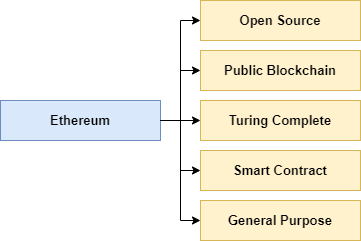

# Belajar Dengan Jenius Tokenomics

## Published 2021

## Penulis : Gun Gun Febrianza


# Ethereum

**Bitcoin** dibangun dengan tujuan yang spesifik yaitu **P2P electronic cash payment**. **Bitcoin** juga menyediakan **scripting language** dalam protokolnya, namun terdapat batasan fungsionalitas untuk scripting pada protokol **bitcoin**. Menulis **script** yang kompleks dalam **bitcoin scripting** sangat sulit karena **bitcoin scripting** tidak **Turing Complete**. 

Demi alasan keamanan (**security**) **scripting** yang disediakan dalam **bitcoin** tidak bersifat **Turing Complete**. **Turing Completeness** mengacu pada kemampuan suatu bahasa pemrograman untuk memecahkan permasalahan komputasi mulai dari program yang sederhana hingga program yang kompleks.

Berdasarkan permasalahan di atas **Vitalik Buterin** membangun protokol **Ethereum** akhir tahun 2013 dan **production** pertama di rilis tahun 2015. Sebuah protokol yang didesain **open source**, **public blockchain**, **general purpose** dan dukungan pembuatan **smart contract** melalui bahasa pemrograman yang sudah mendukung **Turing Complete**.



## Turing Complete

**Turing Complete** artinya kita dapat membuat program yang rumit dalam **Protokol Ethereum**, namun dengan catatan tingkat kompleksitas juga linear dengan resiko keamananya (**Complexity**-**Security Problem**). 

Karena itu sifat **Turing Complete** yang secara natural memiliki kekurangan yaitu program tidak bisa diprediksikan kalau tidak dieksekusi dulu (**termination** & **infinity loop problem**). Maka digagaslah konsep **Gas** dalam **Ethereum** sebagai mekanisme keamanannya, setiap intruksi dibebankan biaya sehingga **Smart Contract** memiliki batasan. 

Sebuah solusi yang jenius. Pembangunan bahasa pemrograman yang bersifat **Turing Complete** untuk **Ethereum Virtual Machine (EVM)** pada protokol **Ethereum** pertama kali di gagas oleh **Gavin Wood** pada tahun 2014. Selanjutnya pengembangan **Project Solidity** dipimpin oleh **Christian Reitwiessner**. 

## Smart Contract

Pada **Ethereum** jika ingin membuat **Smart Contract**, kita dapat menulisnya menggunakan bahasa pemrograman **Solidity**. **Smart Contract** yang telah ditulis harus dikompilasi kedalam bahasa **Intermediate Level** yang disebut dengan **EVM Bytecode** agar dapat berjalan dalam **Ethereum Virtual Machine (EVM)**.

 

## General Purpose

**Ethereum** sebagai **General Purpose** artinya para **Founder Ethereum** berpikir bagaimana caranya sekumpulan aplikasi dapat diprogram untuk di tanam ke dalam **Blockchain**. Bagaimana aplikasi tersebut dapat dibuat tanpa perlu melakukan skema **Reinventing The Wheels**, tanpa perlu memahami kerumitan protokol sebuah **Cryptocurrency**.


**Ethereum Platform** harus bisa menyediakan sebuah lingkungan yang dapat digunakan untuk membangun aplikasi terdesentralisasi (**DApps**) dengan output **Deterministic**. Menyediakan sebuah lingkungan yang dapat digunakan membuat **DApps** dengan mudah tanpa perlu memahami kerumitan protokol **Cryptocurrency**.

## Current Problem State

Transaksi dalam **public blockchain** seperti **bitcoin** dan **ethereum** masih lamban, problema **high throughput transaction** masih belum bisa diselesaikan. Transaksi dalam protokol **Bitcoin** rata-rata diproses sekitar 10 menit sekali dan para protokol **Ethereum** rata-rata 15 detik.

**Mainframe Computing** masih menjadi **champion** dalam dunia transaksi keuangan, **Mainframe Computer** seperti **IBM z13** memiliki kapabilitas untuk memproses **2.5 billion transaction/day** dan **IBM z15** memiliki kapabilitas untuk memproses **1 trillion web transaction/day.**

Saat ini kemampuan maksimum transaksi yang dapat dilakukan pada protokol **Ethereum** sebesar 1,4 juta transaksi/perhari dan pada protokol **Bitcoin** sekitar 300.000 transaksi/perhari. Beberapa solusi yang sedang dikembangkan saat ini adalah :

1. **Ethereum** masih berjalan seperti **Single-threaded Computer**, memproses satu transaksi dalam satu waktu. Sehingga sharding pada **blockchain** dapat membantu meningkatkan performance seperti **Multithreaded Computer**.
2. Solusi **Layer 2**, seperti **Plasma** dan **State Channel** mendukung **Off-chain Transaction** dengan kecepatan transaksi mendekati **realtime**. Transaksi ini akan dikirim menuju **Main Chain** secara periodik. Pada protokol **Bitcoin** terdapat **Lightning Network** untuk mendukung **Off-chain Transaction**.

## Ethereum Architecture

Terdapat berbagai entitas di dalam jaringan **Ethereum**, mulai dari **Miners**, **Full Nodes** hingga pengguna **Lightweight Nodes**. Setiap **Nodes** terhubung secara **P2P** (**Peer-to-Peer**) dan setiap **Nodes** selain **Lightweight Nodes** memiliki salinan secara penuh **Ethereum Blockchain**. 


Salah satu **Ethereum Client** yang saat ini aktif dikembangkan adalah **Geth**.

### P2P Network

Dalam jaringan **P2P** terdapat dua atau lebih komputer yang terhubung untuk berbagi **resources** tanpa harus mengandalkan sistem yang tersentral.

### Node

**Node** adalah setiap perangkat komputer yang terhubung ke dalam jaringan **Ethereum**. Setiap **Node** memiliki salinan terbaru dari **Ethereum Blockchain** secara aktual selama terhubung ke internet. Setiap **Node** dapat melakukan transaksi secara independen. 

Terdapat tiga tipe **Node** :

- **Full Node**
- **Lightweight Node**
- **Miners**

### Full Node

**Full Node** akan menyalin seluruh data **Ethereum Blockchain** terbaru dan berpartisipasi dalam kegiatan memverifikasi setiap **block** dan transaksi sesuai dengan **Consensus Mechanism** yang digunakan.

### Lightweight Node

**Lightweight Node** adalah **node** yang tidak menyimpan seluruh salinan data **Ethereum Blockchain**. **Lightweight Node** hanya digunakan untuk memverifikasi transaksi menggunakan metode **Simple Payment Verification (SPV)**. Metode ini digunakan untuk memverifikasi apakah suatu transaksi sudah tertanam dalam ethereum blockchain atau belum.

Dengan metode **Simple Payment Verification (SPV)** verifikasi dapat dilakukan tanpa perlu menyalin seluruh data **Ethereum Blockchain**, **lightweight node** hanya menyimpan seluruh data **header information** dalam suatu **blocks** sebagai solusi untuk mengurangi penyimpanan data **blockchain** yang ukurannya sangat besar.

### Miners

**Miners** adalah **node** yang memberikan kontribusi **storage** dan **computation power** sebagai **resources** untuk mengeksekusi **consensus mechanism** untuk memverifikasi transaksi dalam protokol **ethereum**. Sebagai gantinya terdapat insentif yang akan mereka dapatkan yaitu :

1. **Block Reward** dan 
2. **Transaction Fees** dari setiap transaksi

### Blocks

**Blockchain** adalah serangkaian **block** dan setiap **block** baru yang dibuat saling terhubung dengan **block** sebelumnya, di dalam setiap **block** terdapat **block header** dan sekumpulan transaksi. **Block** yang pertama kali dibuat disebut dengan genesis **block**. 


Setiap **block header** menyimpan **metadata** berupa informasi terkait data **block** sebelumnya. Ada banyak sekali **properties** dalam **block header** namun kita cukup memahami beberapa **properties** yang relevan saja untuk memahami proses **block generation** :


#### Parent Hash 

Informasi **hash** terkait **block** sebelumnya disebut dengan **parent block**, setiap **block header** akan menyimpan parent hash sampai **block** yang tidak memiliki nilai **parent hash** di paling ujung yaitu **genesis block**.

#### Nonce 

Sebuah **number** yang ditemukan oleh **miners** untuk memecahkan **cryptographic puzzle**.

#### Receipt Roots 

Sebuah **Keccak 256-bit hash** dari **root node** dalam **tree data structure**.

#### Timestamp 

Waktu saat **blockchain** diproduksi dan disimpan ke dalam **Ethereum Blockchain**.

#### Transaction Root 

Sebuah **Keccak 256-bit hash** dari **root node** dalam **tree data structure** yang ada di dalam setiap transaksi.

#### State Root

Sebuah **Keccak 256-bit hash** dari **root node** dalam **state tree** setelah seluruh transaksi dieksekusi.

Pada protokol **Ethereum** setiap **block** diproduksi menggunakan **PoW Algorithm** yang diberi nama **Ethash**. **Block** terbaru akan diproduksi dengan interval waktu rata-rata 15 detik.


### EVM (Ethereum Virtual Machine)

**Ethereum Virtual Machine (EVM)** adalah sebuah **Runtime Engine** untuk mengeksekusi **Smart Contract**. **State Transition** di setiap **nodes** di proses oleh **Ethereum Virtual Machine (EVM)**. Terdapat beberapa bahasa pemrograman **high-level** yang dapat digunakan untuk membuat sebuah **Smart Contract** :


Pengembangan **LLL**, **Serpent** dan **Bamboo** sudah mulai jarang, pengembangan **Solidity** dan **Vyper** masih aktif dan intens saat buku ini ditulis.

Pada **Ethereum** jika ingin membuat **Smart Contract**, kita dapat menulisnya menggunakan bahasa pemrograman **Solidity**. **Smart Contract** yang telah ditulis harus dikompilasi kedalam bahasa **Intermediate Level** yang disebut dengan **EVM Bytecode** agar dapat berjalan dalam **Ethereum Virtual Machine (EVM)**.

**---Brain-Dump**

Sebagai bahasa High-Level Language yang human readable. 

Setelah dikompilasi smart contract harus di deploy pada ethereum platform menggunakan transaksi contract creation. Transaksi dikirimkan menuju Contract Creation Address yang diawali 0x0. Setiap contract  dikenali melalui ethereum address yang berasal dari transaksi contract creation.

**Smart Contract** dalam jaringan ethereum tidak dieksekusi secara parallel. Ethereum adalah world computer yang mekanisme eksekusinya berbasis single-threaded.

Setiap **block** telah di **hardcode** menyediakan batasan **Gas Limit** sekitar 8 juta **gas** per **block**. Ini artinya total **gas** yang digunakan dalam setiap transaksi pada suatu **block** tidak dapat melebihi 8 juta **gas** per **block**.


**---Brain-Dump**

# Smart Contract


# Solidity 

**Solidity** adalah bahasa pemrograman dengan karakteristik **Statically Typed Language**. Artinya tipe data suatu variable harus didefinisikan terlebih dahulu dengan jelas. 

# Solidity Anatomy

## SPDX License Identifier

**Trust** ditandai dengan tersedianya **source code** yang terbuka, namun menyediakan **source code** yang terbuka artinya berhadapan dengan permasalahan legal terkait **copyright**. 

**Compiler** menegaskan penerapan **SPDX License Identifier**, (**Software Package Data Exchange**) setiap **file** harus diawali sebuah komentar yang mengindikasikan sebuah **license** :

**// SPDX-License-Identifier : MIT**

**Compiler** tidak akan memvalidasi apakah **license** bagian dari yang [diizinkan](https://spdx.org/licenses/) dalam **SPDX** atau tidak, namun akan menyimpannya kedalam **Contract Metadata / bytecode metadata**.

Jika anda tidak ingin memberikan spesifikasi license atau source code tidak bersifat open source maka gunakan special value **UNLICENSED**.

Informasi lebih lengkap terkait SPDX License Identifier dapat ditemui di [sini](https://spdx.org/ids-how).

## Pragma

Keyword pragma digunakan untuk check atau menjalankan fitur-fitur tertentu dalam compiler.

## State Variables

**State Variables** adalah **variables** yang nilainya tersimpan secara **permanent** dalam **Contract Storage**.

# Types

## Value Types

## Reference Types 

### Arrays

### Structs

Solidity menyediakan cara untuk membuat sebuah types baru menggunakan structs. Di bawah ini contoh structs :

```
struct Funder {
    address addr;
    uint amount;
}
```

Struct di atas mendefinisikan type funder yang didalamnya terdapat dua buah fields, struct yang di deklarasikan diluar contract dapat digunakan oleh contracts lainnya.

## Mapping Types

# DApps

**DApps** mengandalkan **Decentralized Storage** dan **Decentralized Communication**. **DApps** menyediakan **layer front-end** sebagai **user interface** untuk berinteraksi dengan **back-end** yang berasal dari sebuah **blockchain**.

