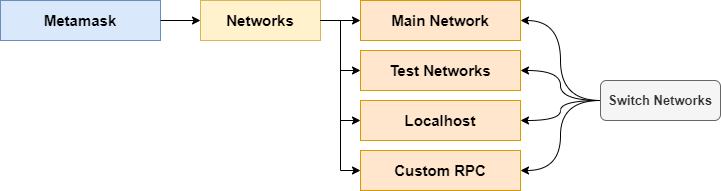
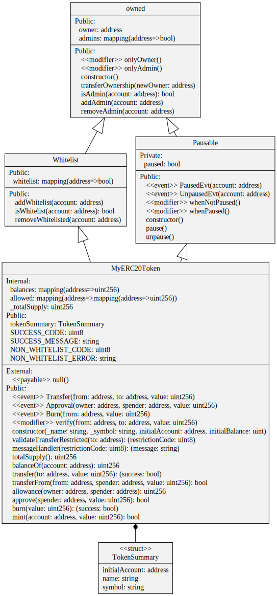
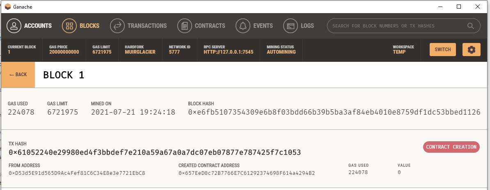
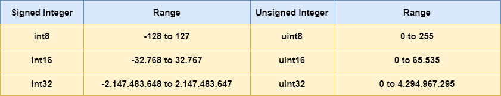
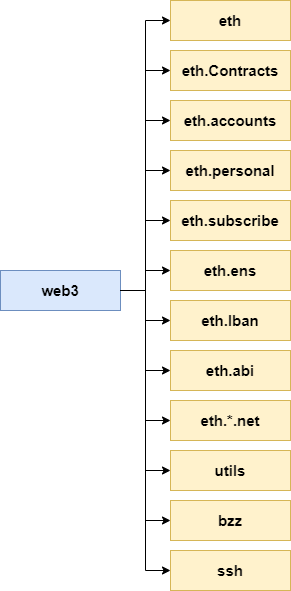

Belajar Dengan Jenius Tokenomics

## 

# Content Tables

- [Ethereum](https://github.com/gungunfebrianza/Belajar-Dengan-Jenius-Tokenomics/blob/main/ebooks/id/Ethereum.md#ethereum)

  - [Open Source](https://github.com/gungunfebrianza/Belajar-Dengan-Jenius-Tokenomics/blob/main/ebooks/id/Ethereum.md#open-source)
  - [Public Blockchain](https://github.com/gungunfebrianza/Belajar-Dengan-Jenius-Tokenomics/blob/main/ebooks/id/Ethereum.md#public-blockchain)
  - [Turing Complete](https://github.com/gungunfebrianza/Belajar-Dengan-Jenius-Tokenomics/blob/main/ebooks/id/Ethereum.md#turing-complete)
  - [Smart Contract](https://github.com/gungunfebrianza/Belajar-Dengan-Jenius-Tokenomics/blob/main/ebooks/id/Ethereum.md#smart-contract)
  - [General Purpose](https://github.com/gungunfebrianza/Belajar-Dengan-Jenius-Tokenomics/blob/main/ebooks/id/Ethereum.md#ethereum)

- [Ethereum Development Stage](https://github.com/gungunfebrianza/Belajar-Dengan-Jenius-Tokenomics/blob/main/ebooks/id/Ethereum.md#ethereum-development-stage)

  - [Frontier](https://github.com/gungunfebrianza/Belajar-Dengan-Jenius-Tokenomics/blob/main/ebooks/id/Ethereum.md#frontier)
  - [Homestead](https://github.com/gungunfebrianza/Belajar-Dengan-Jenius-Tokenomics/blob/main/ebooks/id/Ethereum.md#homestead)
  - [Metropolis](https://github.com/gungunfebrianza/Belajar-Dengan-Jenius-Tokenomics/blob/main/ebooks/id/Ethereum.md#metropolis)
  - [Serenity](https://github.com/gungunfebrianza/Belajar-Dengan-Jenius-Tokenomics/blob/main/ebooks/id/Ethereum.md#serenity)
    - [Validator](https://github.com/gungunfebrianza/Belajar-Dengan-Jenius-Tokenomics/blob/main/ebooks/id/Ethereum.md#validator)
    - [Sharding](https://github.com/gungunfebrianza/Belajar-Dengan-Jenius-Tokenomics/blob/main/ebooks/id/Ethereum.md#sharding)

- [Current Problem State](https://github.com/gungunfebrianza/Belajar-Dengan-Jenius-Tokenomics/blob/main/ebooks/id/Ethereum.md#current-problem-state)

  - [Scalability](https://github.com/gungunfebrianza/Belajar-Dengan-Jenius-Tokenomics/blob/main/ebooks/id/Ethereum.md#scalability)
  - [Bottleneck](https://github.com/gungunfebrianza/Belajar-Dengan-Jenius-Tokenomics/blob/main/ebooks/id/Ethereum.md#bottleneck)

- [Ethereum Architecture](https://github.com/gungunfebrianza/Belajar-Dengan-Jenius-Tokenomics/blob/main/ebooks/id/Ethereum.md#ethereum-architecture)

  - [P2P Network](https://github.com/gungunfebrianza/Belajar-Dengan-Jenius-Tokenomics/blob/main/ebooks/id/Ethereum.md#p2p-network)
  - [Node](https://github.com/gungunfebrianza/Belajar-Dengan-Jenius-Tokenomics/blob/main/ebooks/id/Ethereum.md#node)
  - [Full Node](https://github.com/gungunfebrianza/Belajar-Dengan-Jenius-Tokenomics/blob/main/ebooks/id/Ethereum.md#full-node)
  - [Lighweight Node](https://github.com/gungunfebrianza/Belajar-Dengan-Jenius-Tokenomics/blob/main/ebooks/id/Ethereum.md#lightweight-node)
  - [Miners](https://github.com/gungunfebrianza/Belajar-Dengan-Jenius-Tokenomics/blob/main/ebooks/id/Ethereum.md#miners)
  - [Blocks](https://github.com/gungunfebrianza/Belajar-Dengan-Jenius-Tokenomics/blob/main/ebooks/id/Ethereum.md#blocks)
  - [EVM (Ethereum Virtual Machine)](https://github.com/gungunfebrianza/Belajar-Dengan-Jenius-Tokenomics/blob/main/ebooks/id/Ethereum.md#evm-ethereum-virtual-machine)
  - [Ether](https://github.com/gungunfebrianza/Belajar-Dengan-Jenius-Tokenomics/blob/main/ebooks/id/Ethereum.md#ether)
  - [Gas](https://github.com/gungunfebrianza/Belajar-Dengan-Jenius-Tokenomics/blob/main/ebooks/id/Ethereum.md#gas)
    - [Gas Limit](https://github.com/gungunfebrianza/Belajar-Dengan-Jenius-Tokenomics/blob/main/ebooks/id/Ethereum.md#gas-limit)
    - [Gas Price](https://github.com/gungunfebrianza/Belajar-Dengan-Jenius-Tokenomics/blob/main/ebooks/id/Ethereum.md#gas-price)
    - [Example](https://github.com/gungunfebrianza/Belajar-Dengan-Jenius-Tokenomics/blob/main/ebooks/id/Ethereum.md#example)
  - [Account](https://github.com/gungunfebrianza/Belajar-Dengan-Jenius-Tokenomics/blob/main/ebooks/id/Ethereum.md#accounts)
    - [Externally Owned Account (EOA)](https://github.com/gungunfebrianza/Belajar-Dengan-Jenius-Tokenomics/blob/main/ebooks/id/Ethereum.md#externally-owned-accounts)
    - [Contract Account](https://github.com/gungunfebrianza/Belajar-Dengan-Jenius-Tokenomics/blob/main/ebooks/id/Ethereum.md#contract-account)
  - [ETH Blockchain Explorer](https://github.com/gungunfebrianza/Belajar-Dengan-Jenius-Tokenomics/blob/main/ebooks/id/Ethereum.md#eth-blockchain-explorer)
  - [Ethereum Networks](https://github.com/gungunfebrianza/Belajar-Dengan-Jenius-Tokenomics/blob/main/ebooks/id/Ethereum.md#ethereum-networks)

- [Ethereum Virtual Machine (EVM)](https://github.com/gungunfebrianza/Belajar-Dengan-Jenius-Tokenomics/blob/main/ebooks/id/Ethereum.md#ethereum-virtual-machine-evm)

- [Smart Contract](https://github.com/gungunfebrianza/Belajar-Dengan-Jenius-Tokenomics/blob/main/ebooks/id/Ethereum.md#smart-contract-1)

  - [Initial Coin Offering (ICO)](https://github.com/gungunfebrianza/Belajar-Dengan-Jenius-Tokenomics/blob/main/ebooks/id/Ethereum.md#initial-coin-offering-ico)
  - [Micropayment](https://github.com/gungunfebrianza/Belajar-Dengan-Jenius-Tokenomics/blob/main/ebooks/id/Ethereum.md#micropayment)

- [Development Tools](https://github.com/gungunfebrianza/Belajar-Dengan-Jenius-Tokenomics/blob/main/ebooks/id/Ethereum.md#development-tools)

  - [Computer Hardwares](https://github.com/gungunfebrianza/Belajar-Dengan-Jenius-Tokenomics/blob/main/ebooks/id/Ethereum.md#computer-hardwares)
  - [Javascript Runtime Engine](https://github.com/gungunfebrianza/Belajar-Dengan-Jenius-Tokenomics/blob/main/ebooks/id/Ethereum.md#javascript-runtime-engine)
  - [Ethereum Client](https://github.com/gungunfebrianza/Belajar-Dengan-Jenius-Tokenomics/blob/main/ebooks/id/Ethereum.md#ethereum-client)
    - [Geth](https://github.com/gungunfebrianza/Belajar-Dengan-Jenius-Tokenomics/blob/main/ebooks/id/Ethereum.md#geth)
    - [Geth Commands](https://github.com/gungunfebrianza/Belajar-Dengan-Jenius-Tokenomics/blob/main/ebooks/id/Ethereum.md#geth-command)
    - [Geth Javascript Console](https://github.com/gungunfebrianza/Belajar-Dengan-Jenius-Tokenomics/blob/main/ebooks/id/Ethereum.md#geth-javascript-console)
    - [Geth List Account](https://github.com/gungunfebrianza/Belajar-Dengan-Jenius-Tokenomics/blob/main/ebooks/id/Ethereum.md#geth-list-account)
    - [Geth Balance Account](https://github.com/gungunfebrianza/Belajar-Dengan-Jenius-Tokenomics/blob/main/ebooks/id/Ethereum.md#geth-balance-account)
    - [Geth Transfer Ether](https://github.com/gungunfebrianza/Belajar-Dengan-Jenius-Tokenomics/blob/main/ebooks/id/Ethereum.md#geth-transfer-ether)
    - [HTTP-RPC Server](https://github.com/gungunfebrianza/Belajar-Dengan-Jenius-Tokenomics/blob/main/ebooks/id/Ethereum.md#http---rpc-server)
    - [Synchronization Mode](https://github.com/gungunfebrianza/Belajar-Dengan-Jenius-Tokenomics/blob/main/ebooks/id/Ethereum.md#synchronization-mode)
  - [Metamask](https://github.com/gungunfebrianza/Belajar-Dengan-Jenius-Tokenomics/blob/main/ebooks/id/Ethereum.md#metamask)
    - [Switch Network](https://github.com/gungunfebrianza/Belajar-Dengan-Jenius-Tokenomics/blob/main/ebooks/id/Ethereum.md#switch-network)
    - [Create & Import Account](https://github.com/gungunfebrianza/Belajar-Dengan-Jenius-Tokenomics/blob/main/ebooks/id/Ethereum.md#create--import-account)
    - [Perform Transaction](https://github.com/gungunfebrianza/Belajar-Dengan-Jenius-Tokenomics/blob/main/ebooks/id/Ethereum.md#perform-transaction)
    - [Token Management](https://github.com/gungunfebrianza/Belajar-Dengan-Jenius-Tokenomics/blob/main/ebooks/id/Ethereum.md#token-management)
  - [Remix](https://github.com/gungunfebrianza/Belajar-Dengan-Jenius-Tokenomics/blob/main/ebooks/id/Ethereum.md#remix)
    - [Runtime Environment](https://github.com/gungunfebrianza/Belajar-Dengan-Jenius-Tokenomics/blob/main/ebooks/id/Ethereum.md#runtime-environment)
    - [Javascript Virtual Machine](https://github.com/gungunfebrianza/Belajar-Dengan-Jenius-Tokenomics/blob/main/ebooks/id/Ethereum.md#javascript-virtual-machine-vm)
    - [Injected Web3](https://github.com/gungunfebrianza/Belajar-Dengan-Jenius-Tokenomics/blob/main/ebooks/id/Ethereum.md#injected-web3)
    - [Web3 Provider](https://github.com/gungunfebrianza/Belajar-Dengan-Jenius-Tokenomics/blob/main/ebooks/id/Ethereum.md#web3-provider)
    - [Compile Smart Contract](https://github.com/gungunfebrianza/Belajar-Dengan-Jenius-Tokenomics/blob/main/ebooks/id/Ethereum.md#compile-smart-contract)
    - [Debug Smart Contract](https://github.com/gungunfebrianza/Belajar-Dengan-Jenius-Tokenomics/blob/main/ebooks/id/Ethereum.md#debug-smart-contract)
    - [ABI & Bytecode](https://github.com/gungunfebrianza/Belajar-Dengan-Jenius-Tokenomics/blob/main/ebooks/id/Ethereum.md#abi--bytecode)
    - [Deploy Smart Contract](https://github.com/gungunfebrianza/Belajar-Dengan-Jenius-Tokenomics/blob/main/ebooks/id/Ethereum.md#deploy-smart-contract)
    - [Solidity Unit Testing](https://github.com/gungunfebrianza/Belajar-Dengan-Jenius-Tokenomics/blob/main/ebooks/id/Ethereum.md#solidity-unit-testing)
    - [Solidity Static Analysis](https://github.com/gungunfebrianza/Belajar-Dengan-Jenius-Tokenomics/blob/main/ebooks/id/Ethereum.md#solidity-static-analysis)
    - [Solidity Linter](https://github.com/gungunfebrianza/Belajar-Dengan-Jenius-Tokenomics/blob/main/ebooks/id/Ethereum.md#solidity-linter)
    - [Documentation Generator](https://github.com/gungunfebrianza/Belajar-Dengan-Jenius-Tokenomics/blob/main/ebooks/id/Ethereum.md#documentation-generator)
    - [Solidity to UML](https://github.com/gungunfebrianza/Belajar-Dengan-Jenius-Tokenomics/blob/main/ebooks/id/Ethereum.md#solidity-to-uml)
    - [Remixd](https://github.com/gungunfebrianza/Belajar-Dengan-Jenius-Tokenomics/blob/main/ebooks/id/Ethereum.md#remixd)
    - [Restore Backup](https://github.com/gungunfebrianza/Belajar-Dengan-Jenius-Tokenomics/blob/main/ebooks/id/Ethereum.md#restore--backup)
  - [Truffle](https://github.com/gungunfebrianza/Belajar-Dengan-Jenius-Tokenomics/blob/main/ebooks/id/Ethereum.md#truffle)
  - [Ganache](https://github.com/gungunfebrianza/Belajar-Dengan-Jenius-Tokenomics/blob/main/ebooks/id/Ethereum.md#ganache)
    - [Install Ganache](https://github.com/gungunfebrianza/Belajar-Dengan-Jenius-Tokenomics/blob/main/ebooks/id/Ethereum.md#install-ganache)
    - [ganache-cli](https://github.com/gungunfebrianza/Belajar-Dengan-Jenius-Tokenomics/blob/main/ebooks/id/Ethereum.md#ganache-cli)
    - [Start ganache-cli](https://github.com/gungunfebrianza/Belajar-Dengan-Jenius-Tokenomics/blob/main/ebooks/id/Ethereum.md#start-ganache-cli)
    - [Ganache User Interface](https://github.com/gungunfebrianza/Belajar-Dengan-Jenius-Tokenomics/blob/main/ebooks/id/Ethereum.md#ganache-user-interface)
    - [Ganache Configuration](https://github.com/gungunfebrianza/Belajar-Dengan-Jenius-Tokenomics/blob/main/ebooks/id/Ethereum.md#ganache-configuration)
    - [View Private Keys](https://github.com/gungunfebrianza/Belajar-Dengan-Jenius-Tokenomics/blob/main/ebooks/id/Ethereum.md#view-private-key)
    - [View Blocks](https://github.com/gungunfebrianza/Belajar-Dengan-Jenius-Tokenomics/blob/main/ebooks/id/Ethereum.md#view-blocks)
    - [View Transactions](https://github.com/gungunfebrianza/Belajar-Dengan-Jenius-Tokenomics/blob/main/ebooks/id/Ethereum.md#view-transactions)
    - [View Contracts](https://github.com/gungunfebrianza/Belajar-Dengan-Jenius-Tokenomics/blob/main/ebooks/id/Ethereum.md#view-contracts)
    - [View Events](https://github.com/gungunfebrianza/Belajar-Dengan-Jenius-Tokenomics/blob/main/ebooks/id/Ethereum.md#view-events)
    - [Integrate With Metamask](https://github.com/gungunfebrianza/Belajar-Dengan-Jenius-Tokenomics/blob/main/ebooks/id/Ethereum.md#integrate-with-metamask)
    - Integrate With Remix
  - [Solidity Compiler](https://github.com/gungunfebrianza/Belajar-Dengan-Jenius-Tokenomics/blob/main/ebooks/id/Ethereum.md#solidity-compiler)
    - [solc-.js](https://github.com/gungunfebrianza/Belajar-Dengan-Jenius-Tokenomics/blob/main/ebooks/id/Ethereum.md#solc-js)
  - [Visual Studio Code (VSC)](https://github.com/gungunfebrianza/Belajar-Dengan-Jenius-Tokenomics/blob/main/ebooks/id/Ethereum.md#visual-studio-code-vsc)

- [Solidity](https://github.com/gungunfebrianza/Belajar-Dengan-Jenius-Tokenomics/blob/main/ebooks/id/Ethereum.md#solidity)

  - [High-level Language](https://github.com/gungunfebrianza/Belajar-Dengan-Jenius-Tokenomics/blob/main/ebooks/id/Ethereum.md#high-level-language)
  - [Object-oriented Language](https://github.com/gungunfebrianza/Belajar-Dengan-Jenius-Tokenomics/blob/main/ebooks/id/Ethereum.md#object-oriented-language)
  - [Statically Typed Language](https://github.com/gungunfebrianza/Belajar-Dengan-Jenius-Tokenomics/blob/main/ebooks/id/Ethereum.md#statically-typed-language)
  - [Case-sensitive Language](https://github.com/gungunfebrianza/Belajar-Dengan-Jenius-Tokenomics/blob/main/ebooks/id/Ethereum.md#case-sensitive-language)
  - [Turing Complete Language](https://github.com/gungunfebrianza/Belajar-Dengan-Jenius-Tokenomics/blob/main/ebooks/id/Ethereum.md#turing-complete-language)

- [Solidity Anatomy](https://github.com/gungunfebrianza/Belajar-Dengan-Jenius-Tokenomics/blob/main/ebooks/id/Ethereum.md#solidity-anatomy)

  - [SPDX License Identifier](https://github.com/gungunfebrianza/Belajar-Dengan-Jenius-Tokenomics/blob/main/ebooks/id/Ethereum.md#spdx-license-identifier)
  - [Pragma](https://github.com/gungunfebrianza/Belajar-Dengan-Jenius-Tokenomics/blob/main/ebooks/id/Ethereum.md#pragma)
    - [Semantic Versioning](https://github.com/gungunfebrianza/Belajar-Dengan-Jenius-Tokenomics/blob/main/ebooks/id/Ethereum.md#semantic-versioning)
  - [Import](https://github.com/gungunfebrianza/Belajar-Dengan-Jenius-Tokenomics/blob/main/ebooks/id/Ethereum.md#import)
  - [Contract](https://github.com/gungunfebrianza/Belajar-Dengan-Jenius-Tokenomics/blob/main/ebooks/id/Ethereum.md#contract)
    - Derived Contract
  - [State Variable](https://github.com/gungunfebrianza/Belajar-Dengan-Jenius-Tokenomics/blob/main/ebooks/id/Ethereum.md#state-variables)
    - [Visibility Specifier](https://github.com/gungunfebrianza/Belajar-Dengan-Jenius-Tokenomics/blob/main/ebooks/id/Ethereum.md#visibility-specifier)
    - [Constant & Immutable](https://github.com/gungunfebrianza/Belajar-Dengan-Jenius-Tokenomics/blob/main/ebooks/id/Ethereum.md#constant--immutable)
  - [Local Variable](https://github.com/gungunfebrianza/Belajar-Dengan-Jenius-Tokenomics/blob/main/ebooks/id/Ethereum.md#local-variable)
  - [Function](https://github.com/gungunfebrianza/Belajar-Dengan-Jenius-Tokenomics/blob/main/ebooks/id/Ethereum.md#function)
  - [Constructor](https://github.com/gungunfebrianza/Belajar-Dengan-Jenius-Tokenomics/blob/main/ebooks/id/Ethereum.md#constructor)
  - Modifier
  - Event
  - Collections

- [Types](https://github.com/gungunfebrianza/Belajar-Dengan-Jenius-Tokenomics/blob/main/ebooks/id/Ethereum.md#types)

  - [Strongly-typed](https://github.com/gungunfebrianza/Belajar-Dengan-Jenius-Tokenomics/blob/main/ebooks/id/Ethereum.md#strongly-typed)
  - [Dynamically-typed](https://github.com/gungunfebrianza/Belajar-Dengan-Jenius-Tokenomics/blob/main/ebooks/id/Ethereum.md#dynamically-typed)
  - [Why Solidity Strongly-typed?](https://github.com/gungunfebrianza/Belajar-Dengan-Jenius-Tokenomics/blob/main/ebooks/id/Ethereum.md#why-solidity-strongly-typed)
  - [Data](https://github.com/gungunfebrianza/Belajar-Dengan-Jenius-Tokenomics/blob/main/ebooks/id/Ethereum.md#data)
  - [Data Types](https://github.com/gungunfebrianza/Belajar-Dengan-Jenius-Tokenomics/blob/main/ebooks/id/Ethereum.md#data-types)
    - [Characteristic uint8](https://github.com/gungunfebrianza/Belajar-Dengan-Jenius-Tokenomics/blob/main/ebooks/id/Ethereum.md#characteristic-uint8)
    - [Range Value uint8](https://github.com/gungunfebrianza/Belajar-Dengan-Jenius-Tokenomics/blob/main/ebooks/id/Ethereum.md#range-value-uint8)
    - [Characteristic int8](https://github.com/gungunfebrianza/Belajar-Dengan-Jenius-Tokenomics/blob/main/ebooks/id/Ethereum.md#characteristic-int8)
    - [Range Value int8](https://github.com/gungunfebrianza/Belajar-Dengan-Jenius-Tokenomics/blob/main/ebooks/id/Ethereum.md#range-value-int8)
  - [Solidity Types](https://github.com/gungunfebrianza/Belajar-Dengan-Jenius-Tokenomics/blob/main/ebooks/id/Ethereum.md#solidity-types)
    - [Default Value](https://github.com/gungunfebrianza/Belajar-Dengan-Jenius-Tokenomics/blob/main/ebooks/id/Ethereum.md#default-value)
  - [Value Types](https://github.com/gungunfebrianza/Belajar-Dengan-Jenius-Tokenomics/blob/main/ebooks/id/Ethereum.md#value-types)
    - [Boolean](https://github.com/gungunfebrianza/Belajar-Dengan-Jenius-Tokenomics/blob/main/ebooks/id/Ethereum.md#booleans)
    - [Integer](https://github.com/gungunfebrianza/Belajar-Dengan-Jenius-Tokenomics/blob/main/ebooks/id/Ethereum.md#integers)
    - [Address](https://github.com/gungunfebrianza/Belajar-Dengan-Jenius-Tokenomics/blob/main/ebooks/id/Ethereum.md#address)
    - [Enum](https://github.com/gungunfebrianza/Belajar-Dengan-Jenius-Tokenomics/blob/main/ebooks/id/Ethereum.md#enum)
  - [Reference Types](https://github.com/gungunfebrianza/Belajar-Dengan-Jenius-Tokenomics/blob/main/ebooks/id/Ethereum.md#reference-types)
    - [Array](https://github.com/gungunfebrianza/Belajar-Dengan-Jenius-Tokenomics/blob/main/ebooks/id/Ethereum.md#arrays)
    - [Struct](https://github.com/gungunfebrianza/Belajar-Dengan-Jenius-Tokenomics/blob/main/ebooks/id/Ethereum.md#structs)
  - [Mapping Types](https://github.com/gungunfebrianza/Belajar-Dengan-Jenius-Tokenomics/blob/main/ebooks/id/Ethereum.md#mapping-types)

- [ERC-20 Token Standard](https://github.com/gungunfebrianza/Belajar-Dengan-Jenius-Tokenomics/blob/main/ebooks/id/Ethereum.md#erc-20-token-standard)

  - [ERC & EIP](https://github.com/gungunfebrianza/Belajar-Dengan-Jenius-Tokenomics/blob/main/ebooks/id/Ethereum.md#erc--eip)
  - [Coin & Token](https://github.com/gungunfebrianza/Belajar-Dengan-Jenius-Tokenomics/blob/main/ebooks/id/Ethereum.md#coin--token)
  - [Function totalSupply()](https://github.com/gungunfebrianza/Belajar-Dengan-Jenius-Tokenomics/blob/main/ebooks/id/Ethereum.md#function-totalsupply)
  - [Function balanceOf()](https://github.com/gungunfebrianza/Belajar-Dengan-Jenius-Tokenomics/blob/main/ebooks/id/Ethereum.md#function-balanceof)
  - [Function transfer()](https://github.com/gungunfebrianza/Belajar-Dengan-Jenius-Tokenomics/blob/main/ebooks/id/Ethereum.md#function-transfer)
  - [Function approve()](https://github.com/gungunfebrianza/Belajar-Dengan-Jenius-Tokenomics/blob/main/ebooks/id/Ethereum.md#function-approve)
  - [Function allowance()](https://github.com/gungunfebrianza/Belajar-Dengan-Jenius-Tokenomics/blob/main/ebooks/id/Ethereum.md#function-allowance)
  - [Function transferFrom()](https://github.com/gungunfebrianza/Belajar-Dengan-Jenius-Tokenomics/blob/main/ebooks/id/Ethereum.md#function-transferfrom)

- [Web3.js](https://github.com/gungunfebrianza/Belajar-Dengan-Jenius-Tokenomics/blob/main/ebooks/id/Ethereum.md#web3js)

  - [Installing Web3.js](https://github.com/gungunfebrianza/Belajar-Dengan-Jenius-Tokenomics/blob/main/ebooks/id/Ethereum.md#installing-web3js)
  - [Promise Events](https://github.com/gungunfebrianza/Belajar-Dengan-Jenius-Tokenomics/blob/main/ebooks/id/Ethereum.md#promise-events)

- [DApps](https://github.com/gungunfebrianza/Belajar-Dengan-Jenius-Tokenomics/blob/main/ebooks/id/Ethereum.md#dapps)

- [Private Ethereum Test Network](https://github.com/gungunfebrianza/Belajar-Dengan-Jenius-Tokenomics/blob/main/ebooks/id/Ethereum.md#private-ethereum-test-network)

- [ETH Validator 2.0](https://github.com/gungunfebrianza/Belajar-Dengan-Jenius-Tokenomics/blob/main/ebooks/id/Ethereum.md#eth-validator-20)

  

# Ethereum

**Bitcoin** dibangun dengan tujuan yang spesifik yaitu **P2P electronic cash payment**. **Bitcoin** juga menyediakan **scripting language** dalam protokolnya, namun terdapat batasan fungsionalitas untuk scripting pada protokol **bitcoin**. Menulis **script** yang kompleks dalam **bitcoin scripting** sangat sulit karena **bitcoin scripting** tidak **Turing Complete**. 

Demi alasan keamanan (**security**) **scripting** yang disediakan dalam **bitcoin** tidak bersifat **Turing Complete**. **Turing Completeness** mengacu pada kemampuan suatu bahasa pemrograman untuk memecahkan permasalahan komputasi mulai dari program yang sederhana hingga program yang kompleks.

Berdasarkan permasalahan di atas **Vitalik Buterin** membangun protokol **Ethereum** akhir tahun 2013 dan **production** pertama di rilis tahun 2015. Sebuah protokol yang didesain **Open Source**, **Public Blockchain**, **General Purpose** dan dukungan pembuatan **Smart Contract** melalui bahasa pemrograman yang sudah mendukung **Turing Complete**.


## Open Source

**Open Source** artinya **Source Code Ethereum** bersifat terbuka, siapapun bisa ikut terjun untuk mengembangkannya bersama komunitas. Setiap pengembangan yang dilakukan para kontributor akan di **review** oleh komunitas jika mayoritas suara merasa inovasi yang dikembangkan memiliki **Value Proposition** yang bagus.


## Public Blockchain

**Blockchain** pada protokol **Ethereum** bersifat transparan secara penuh, siapapun dapat mendapatkan dan melihat isinya melalui **Blockchain Explorer** yang telah disediakan oleh komunitas. **Public Blockchain** juga memberikan makna bahwa setiap entitas dalam protokol **Ethereum** akan mendapatkan perlakuan yang sama dan setara.


## Turing Complete

Terminologi **Turing** diambil dari nama seorang figur dalam dunia **Computer Science**, yaitu **Alan Turing**. **Turing Complete** artinya kita dapat membuat **program** yang rumit dalam **Protokol Ethereum**, namun dengan catatan tingkat kompleksitas juga linear dengan resiko keamananya (**Complexity**-**Security Problem**). 

Karena itu sifat **Turing Complete** yang secara natural memiliki kekurangan yaitu program tidak bisa diprediksikan kalau tidak dieksekusi dulu (**termination** & **infinity loop problem**). Maka digagaslah konsep **Gas** dalam **Ethereum** sebagai mekanisme keamanannya, setiap intruksi dibebankan biaya sehingga **Smart Contract** memiliki batasan. 

**Gas** adalah sebuah solusi yang jenius, gas adalah konsep **metering mechanism** yang dapat digunakan untuk membatasi komputasi **Smart Contract**.

Kaum antagonis dapat memanfaatkan karakteristik **Turing Complete** yang dapat menimbulkan **infinite loops** pada **program smart contract** untuk menulis **malicious program (Malware)** atau bisa juga terjadi karena **Human-error** yang dilakukan secara tidak sengaja.


Pembangunan bahasa pemrograman yang bersifat **Turing Complete** untuk **Ethereum Virtual Machine (EVM)** pada protokol **Ethereum** pertama kali di gagas oleh **Gavin Wood** pada tahun 2014. Selanjutnya pengembangan **Project Solidity** dipimpin oleh **Christian Reitwiessner**. 


## Smart Contract

Pada **Ethereum** jika ingin membuat **Smart Contract**, kita dapat menulisnya menggunakan bahasa pemrograman **Solidity**. **Smart Contract** yang telah ditulis harus dikompilasi kedalam bahasa **Intermediate Level** yang disebut dengan **EVM Bytecode** agar dapat berjalan dalam **Ethereum Virtual Machine (EVM)**.

 

Dengan dukungan **Turing Complete**, **Ethereum Virtual Machine (EVM)** dapat melakukan komputasi seluruh algoritma dari setiap program **Smart Contract** yang tertanam dalam **Ethereum Blockchain**.


Setiap **Smart Contract**, memiliki **Contract Address** dan untuk menjalankan sebuah **Smart Contract** diseluruh **Node** kita harus melakukan sebuah **Transaction**. Sebuah **Transaction** dapat digunakan untuk memanggil fungsi tertentu dalam **Smart Contract**, atau memberikan input data pada **Smart Contract** untuk mengubah **State** di dalamnya.


State yang diubah oleh **Smart Contract** pada **Ethereum Blockchain** ketika telah disetujui oleh **miner** akan menimbulkan perubahan pada **Global State Machine**, ketika perubahan **state** berhasil dilakukan maka seseorang yang melakukan **transaction** telah melakukan **Global State Transation**.

**Ethereum** adalah sebuah **Distributed State Machine** yang tidak hanya melacak **state** setiap **currency ownersip** seperti dalam protokol **Bitcoin**. **Ethereum** juga melacak **arbitraty state transition** yang dapat digunakan untuk menyimpan berbagai data, kita dapat menyimpan sebuah data dengan struktur data **key-value**.

**Ethereum** menyediakan sebuah **memory** untuk menyimpan sebuah program yang terdiri dari **code** dan **data**, **program** dapat dimuat ke dalam **State Machine**, untuk dieksekusi dan menyimpan hasil **State Changes** ke dalam **Ethereum Blockchain**. **State Transition** di setiap **nodes** di proses oleh **Ethereum Virtual Machine (EVM)**.


## General Purpose

**Ethereum** sebagai **General Purpose** artinya para **Founder Ethereum** berpikir bagaimana caranya sekumpulan aplikasi dapat diprogram untuk di tanam ke dalam **Blockchain**. Bagaimana aplikasi tersebut dapat dibuat tanpa perlu melakukan skema **Reinventing The Wheels**, tanpa perlu memahami kerumitan protokol sebuah **Cryptocurrency**.


**Ethereum Platform** harus bisa menyediakan sebuah lingkungan yang dapat digunakan untuk membangun aplikasi terdesentralisasi (**DApps**) dengan output **Deterministic**. Menyediakan sebuah lingkungan yang dapat digunakan membuat **DApps** dengan mudah tanpa perlu memahami kerumitan protokol **Cryptocurrency**.


# Ethereum Development Stage

Terdapat 4 **Development Stage** untuk pengembangan **Ethereum Protocol** :

1. **Stage One : Frontier**
2. **Stage Two : Homestead**
3. **Stage Three : Metropolis**
4. **Stage Four : Serenity**


## Frontier


## Homestead

Stage kedua diluncurkan pada bulan Maret Tahun 2016.


## Metropolis


## Serenity

**Serenity** adalah **stage** yang menjadi tujuan akhir dari **Ethereum Protocol**. Terdapat migrasi secara komplit dari **Proof of Work (PoW)** ke dalam **Proof of Stake (PoS)**. Permasalahan seperti **High Fee**, **Low Transaction Throughput** dan **Settlement Speed** dianggap dapat diselesaikan dengan cara mengganti **Consensus Mechanism Proof of Work (PoW)**.

Para **Ethereum Developer** memilih **Proof of Stake (PoS)** untuk menyederhanakan proses verifikasi transaksi. Daripada mengandalkan para **miner** untuk memproduksi **block** baru, **Proof of Stake (PoS)** memberikan kesempatan kepada para **Ethereum Hodler** untuk memproduksi **block** baru menggantikan para **miner**.

### Validator

Para **Ethereum Holder** yang menggantikan para **miner** disebut dengan **Validator**, untuk menjadi **validator** syaratnya adalah melakukan **Staking** sebesar **32 ETH** dalam sebuah **Deposit Contract** agar memiliki hak untuk memverifikasi suatu transaksi. Bisa secara individual atau bersama-sama melalui sebuah **Staking Pool**.

Para **Validator** akan diberikan tanggung jawab secara **Random** untuk melakukan **Voting** terkait validitas suatu transaksi, yang selanjutnya validitas akan diuji oleh seluruh partisipan dalam jaringan. Jika **Vote** dinyatakan valid maka **validator** akan mendapatkan **Reward** sebagai hadiah kejujuran mereka.

Jika terdapat **Malicious Validator** yang akhirnya ketahuan melakukan **Vote** yang tidak valid maka **ETH** yang mereka **Stake** akan disita sebagai sebuah hukuman (**Penalty**). 

Penerapan **Proof of Stake (PoS)** mampu menghasilkan efisiensi energi dan meningkatkan kecepatan transaksi, sementara **Proof of Work (PoW)** mengandalkan penggunaan energi besar-besaran untuk melakukan komputasi memecahkan **Cryptographic Puzzle**.

### Sharding

Selain itu terdapat Mekanisme **Scalability** baru yang akan diterapkan yaitu menggunakan konsep **Sharding**, pada kajian **Database Management System** konsep **sharding** digunakan untuk melakukan **optimization** dengan cara memecah **tables** berukuran besar ke dalam sekumpulan **table** kecil.

**Table** baru yang dipisahkan dari **Original Table** di sebut dengan **Shard** dan **Sharding** adalah tehnik yang digunakan untuk membangun **Scalable Database Architecture**. Vitalik telah melihat pemanfaatan tehnik **sharding** untuk permasalahan **Scalability** dalam **Ethereum Protocol**.

Inti dari **Sharding** adalah memecahkan permasalahan problema klasik dalam Dunia **Cryptocurrency** yaitu **The Scalability Trilemma** :


**Trilemma** di atas menegaskan terdapat 3 **properties** dalam **blockchain** namun hanya 2 **properties** yang dapat kita miliki jika menggunakan inovasi teknologi **blockchain** saat ini :

1. **Scalability** -  Kemampuan protokol untuk dapat memproses transaksi lebih banyak.
2. **Decentralized** - Kemampuan protokol untuk dapat berjalan tanpa mengandalkan sistem tersentral.
3. **Secure** - Kemampuan protokol untuk dapat memecahkan permasalahan **Byzantine General Problem**.

Pada **Traditional Chains** seperti **Bitcoin**, **Litecoin**, **Ethereum** dan **Blockchain** lainnya sangat bergantung pada para partisipan untuk membangun **Full Node Client** yang dapat memverifikasi transaksi. Kondisi ini memberikan karakteristik **Decentralization** dan **Secure** namun tidak **Scalable**.

Pada **High-Transaction per seconds Chains** seperti **DPoS (Delegated Proof of Stake)** mereka bergantung pada sekumpulan **nodes** dalam jumlah kecil, bisa 10-100 lebih **nodes** untuk memanajemen konsensus. Para partisipan dalam protokol tersebut harus mempercayai sekumpulan **nodes** tersebut. Kondisi ini memberikan karakteristik **Scalable** dan dianggap **Secure** namun memiliki derajat **decentralization** yang tidak murni.

Pada **Multi-chain Ecosystem** berbagai aplikasi dapat berjalan di berbagai **chains** dan dapat berinteraksi dengan memanfaatkan **Cross-chain Communication Protocol**. Kondisi ini memberikan karakteristik **Decentralization** dan **Scalable**, namun tidak **secure**.

Sekali lagi **Vitalik** melihat pemanfaatan tehnik **sharding** agar dapat memecahkan permasalahan **The Scalability Trilemma**, tehnik **sharding** yang di gagas **Vitalik** dalam **Ethereum Protocol** digunakan untuk mendapatkan 3 karakteristik sekaligus. 

Melihat **track record** **Vitalik** memecahkan problema **Turing Complete** dengan cara yang jenis membuat penulis beropini, **Vitalik** juga dapat memecahkan problema **The Scalability Trilemma**. Di bawah ini adalah manfaat yang akan di dapatkan **Ethereum Protocol** jika berhasil memanfaatkan tehnik **Sharding** :

1. **Scalable** - **Ethereum Protocol** dapat memproses lebih banyak transaksi.
2. **Decentralized** - **Ethereum Protocol** menjadi lebih **low barrier** untuk digunakan para **client**, **Vitalik** secara spesifik menjelaskan **sharding** dapat menghapus kebutuhan **supernodes**.
3. **Secure** - **Ethereum Protocol** menjadi lebih aman karena para **attacker** tidak dapat menargetkan serangan pada bagian terkecil dari sistem dengan jumlah **resources** yang terbatas.

Tehnik **Sharding** yang akan diterapkan pada **Ethereum Protocol** adalah **Quadratic** **Sharding**.


# Current Problem State

## Scalability

Transaksi dalam **public blockchain** seperti **bitcoin** dan **ethereum** masih lamban, problema **high throughput transaction** masih belum bisa diselesaikan. Transaksi dalam protokol **Bitcoin** rata-rata diproses sekitar 10 menit sekali dan para protokol **Ethereum** rata-rata 15 detik.

**Mainframe Computing** masih menjadi **champion** dalam dunia transaksi keuangan, **Mainframe Computer** seperti **IBM z13** memiliki kapabilitas untuk memproses **2.5 billion transaction/day** dan **IBM z15** memiliki kapabilitas untuk memproses **1 trillion web transaction/day.**

Saat ini kemampuan maksimum transaksi yang dapat dilakukan pada protokol **Ethereum** sebesar 1,4 juta transaksi/perhari dan pada protokol **Bitcoin** sekitar 300.000 transaksi/perhari. Beberapa solusi yang sedang dikembangkan saat ini adalah :

1. **Ethereum** masih berjalan seperti **Single-threaded Computer**, memproses satu transaksi dalam satu waktu. Sehingga **Sharding** pada **blockchain** dapat membantu meningkatkan **performance** seperti **Multithreaded Computer**.
2. Solusi **Layer 2**, seperti **Plasma** dan **State Channel** mendukung **Off-chain Transaction** dengan kecepatan transaksi mendekati **realtime**. Transaksi ini akan dikirim menuju **Main Chain** secara periodik. Pada protokol **Bitcoin** terdapat **Lightning Network** untuk mendukung **Off-chain Transaction**.


## Bottleneck

Jika kita berbicara seberapa banyak dan maksimal sebuah **Full Node** dapat bergabung dalam C**ryptocurrency Protocol**, kita harus melihat limitasi dari komputer yang digunakan para **Client**. Di bawah ini adalah limitasi tersebut :


**Computing Power** untuk menjalankan **Full Node** agar dapat melakukan **block verification**, **Bandwidth** mempengaruhi seberapa besar **block** dapat diterapkan, dan **Storage** menentukan seberapa besar salinan **blockchain** yang harus disimpan, juga seberapa cepat **hardware readability** yang diperlukan menentukan kelas **storage** yang akan digunakan baik itu **Solid State-drive (SSD)** atau **Hard Disk-drive (HDD)**.

**Storage Size** juga mempengaruhi waktu yang diperlukan oleh sebuah **Full Node** untuk dapat online dan bergabung lagi dalam jaringan. Semakin cepat sebuah **Full Node** dapat bergabung ke dalam jaringan meningkatkan derajat keamanan suatu **Cryptocurrency Protocol**.

Saat ini dalam **Ethereum Protocol** permasalahan **Blockchain Size** menjadi **concern** utama para **Ethereum Developer**,  namun **Vitalik** dan para **Ethereum Developer** lainnya sudah menemukan masalah dengan cara menerapkan inovasi **Statelessness** and **State Expiry**.

1. **Statelessness** menggaggas pembuatan 2 tipe **nodes** : terdapat dua **node** yang membutuhkan **state data** dan **node** yang tidak membutuhkan **state data**. Agar sebuah **node** tidak lagi memerlukan **state** untuk melakukan validasi **block**, **witnesses** harus bisa menyediakan potongan **state data** pada **transaction** tertentu menggunakan **Cryptographic Proof** untuk menguji kebenarannya.

2. **State Expiry** menggaggas konsep **active state** dan **old state**, berfungsi untuk mencabut **state** yang sudah lama tidak diakses. **State Expiry** juga membutuhkan **witnesses** jika terdapat aktivitas **recovery** pada **state** yang sudah **expire**. **State Storage** yang menjadi **weakpoint** dari **Ethereum Economic** dapat diperbaiki dengan turunnya kebutuhan tempat penyimpanan data **approximately** sebesar **20-50 GB**.

   Rekomendasi Expiration Date belum 

3. sda


# Ethereum Architecture

Terdapat berbagai entitas di dalam jaringan **Ethereum**, mulai dari **Miners**, **Full Nodes** hingga pengguna **Lightweight Nodes**. Setiap **Nodes** terhubung secara **P2P** (**Peer-to-Peer**) dan setiap **Nodes** selain **Lightweight Nodes** memiliki salinan secara penuh **Ethereum Blockchain**. 


Salah satu **Ethereum Client** yang saat ini aktif dikembangkan adalah **Geth**.


## P2P Network

Dalam jaringan **P2P** terdapat dua atau lebih komputer yang terhubung untuk berbagi **resources** tanpa harus mengandalkan sistem yang tersentral.


## Node

**Node** adalah setiap perangkat komputer yang terhubung ke dalam jaringan **Ethereum**. Setiap **Node** memiliki salinan terbaru dari **Ethereum Blockchain** secara aktual selama terhubung ke internet. Setiap **Node** dapat melakukan transaksi secara independen. 

Terdapat tiga tipe **Node** :

- **Full Node**
- **Lightweight Node**
- **Miners**


## Full Node

**Full Node** akan menyalin seluruh data **Ethereum Blockchain** terbaru dan berpartisipasi dalam kegiatan memverifikasi setiap **block** dan transaksi sesuai dengan **Consensus Mechanism** yang digunakan.


## Lightweight Node

**Lightweight Node** adalah **node** yang tidak menyimpan seluruh salinan data **Ethereum Blockchain**. **Lightweight Node** hanya digunakan untuk memverifikasi transaksi menggunakan metode **Simple Payment Verification (SPV)**. Metode ini digunakan untuk memverifikasi apakah suatu transaksi sudah tertanam dalam ethereum blockchain atau belum.

Dengan metode **Simple Payment Verification (SPV)** verifikasi dapat dilakukan tanpa perlu menyalin seluruh data **Ethereum Blockchain**, **lightweight node** hanya menyimpan seluruh data **header information** dalam suatu **blocks** sebagai solusi untuk mengurangi penyimpanan data **blockchain** yang ukurannya sangat besar.


## Miners

**Miners** adalah **node** yang memberikan kontribusi **storage** dan **computation power** sebagai **resources** untuk mengeksekusi **consensus mechanism** untuk memverifikasi transaksi dalam protokol **ethereum**. Sebagai gantinya terdapat insentif yang akan mereka dapatkan yaitu :

1. **Block Reward** dan 
2. **Transaction Fees** dari setiap transaksi


## Blocks

**Blockchain** adalah serangkaian **block** dan setiap **block** baru yang dibuat saling terhubung dengan **block** sebelumnya, di dalam setiap **block** terdapat **block header** dan sekumpulan transaksi. **Block** yang pertama kali dibuat disebut dengan genesis **block**. 


Setiap **block header** menyimpan **metadata** berupa informasi terkait data **block** sebelumnya. Ada banyak sekali **properties** dalam **block header** namun kita cukup memahami beberapa **properties** yang relevan saja untuk memahami proses **block generation** :


### Parent Hash 

Informasi **hash** terkait **block** sebelumnya disebut dengan **parent block**, setiap **block header** akan menyimpan parent hash sampai **block** yang tidak memiliki nilai **parent hash** di paling ujung yaitu **genesis block**.


### Nonce 

Sebuah **number** yang ditemukan oleh **miners** untuk memecahkan **cryptographic puzzle**.


### Receipt Roots 

Sebuah **Keccak 256-bit hash** dari **root node** dalam **tree data structure**.


### Timestamp 

Waktu saat **blockchain** diproduksi dan disimpan ke dalam **Ethereum Blockchain**.


### Transaction Root 

Sebuah **Keccak 256-bit hash** dari **root node** dalam **tree data structure** yang ada di dalam setiap transaksi.


### State Root

Sebuah **Keccak 256-bit hash** dari **root node** dalam **state tree** setelah seluruh transaksi dieksekusi.

Pada protokol **Ethereum** setiap **block** diproduksi menggunakan **PoW Algorithm** yang diberi nama **Ethash**. **Block** terbaru akan diproduksi dengan interval waktu rata-rata 15 detik.


## EVM (Ethereum Virtual Machine)

**Ethereum Virtual Machine (EVM)** adalah sebuah **Runtime Engine** untuk mengeksekusi program **Smart Contract** yang telah dikompilasi kedalam **EVM Bytecodes**, yang disebut dengan **Opcode**. Selanjutnya **Opcode** harus di **deploy** pada **Ethereum Blockchain** agar dapat digunakan.


Terdapat beberapa bahasa pemrograman **high-level** yang dapat digunakan untuk membuat sebuah **Smart Contract** :


Pengembangan **LLL**, **Serpent** dan **Bamboo** sudah mulai jarang, pengembangan **Solidity** dan **Vyper** masih aktif dan intens saat buku ini ditulis.


## Ether

Mata uang dalam **Ethereum** di sebut dengan **Ether** dengan simbol **ETH**. **Ether** bersifat **fungible** yang dapat dibagi kedalam **unit** terkecil dengan maksimum 18 digit, 1 **Ether** (**ETH**) dapat direcah kedalam unit terkecil yang di sebut dengan **wei**. 1 **Ether** merepresentasikan 1 **Quintillion Wei** (1,000,000,000,000,000,000).


Secara internal, **value ether** direpresentasikan dalam **unsigned integer wei**. Setiap transaksi yang dilakukan dalam protokol **Ethereum** memerlukan sebuah biaya berupa **gas** yang harus dibeli menggunakan **Ether**. Biaya tersebut selanjutnya akan menjadi insentif untuk para **miners**.


## Gas

Sebelumnya kita telah memahami bahwa gas digunakan sebagai **metering mechanism** agar dapat membangun program **smart contract** yang aman dengan dukungan **turing complete**. **Gas** juga digunakan sebagai biaya dalam setiap transaksi untuk skema insentif untuk para **miners**.


Setiap **Block** dalam **Ethereum** juga dibatasi untuk setiap transaksinya dengan jumlah 8 juta **Gas**. **Ethereum** akan merekomendasikan seberapa besar **Gas Fee** yang diperlukan untuk melakukan transaksi. **Gas** hanya dapat dibeli menggunakan **ether**.


Saat kita melakukan transaksi pada protokol **Ethereum**, kita dapat menentukan **Gas Price** dan **Gas Limit** setelah mendapatkan bantuan rekomentasi dari protokol **Ethereum**. 


### Gas Limit

**Gas Limit** adalah prediksi maksimum jumlah **Gas** yang diperlukan untuk melakukan transaksi, jika pada akhirnya jumlah **Gas** yang dikonsumsi lebih sedikit maka sisa **Gas** akan dikembalikan lagi pada pemiliknya. Jika jumlah **Gas** yang diperlukan tidak mencukupi maka transaksi akan gagal, lengkap dengan kerugian kehilangan **Gas**.


### Gas Price

Gas Price adalah harga untuk setiap unit **Gas** yang harus dibayar agar transaksi dapat dilakukan. Jumlah **Gas Price** diukur dalam satuan **Gwei**, jika kita memberikan **Gas Price** yang tinggi maka transaksi akan lebih diprioritaskan untuk dieksekusi oleh **miners**. Jika **Gas Price** rendah maka transaksi akan kurang diprioritaskan.


### Example

Pada kasus di bawah ini jika kita memiliki **0.1 ETH** maka, maksimum **ETH** yang dapat dikirimkan sebesar **0,09995 ETH** dikarenakan terdapat **Gas Fee** yang diperlukan untuk mengirimkan **0,09995 ETH** . Saat buku ini ditulis **Ethereum** merekomendasikan **Gas Limit** sebesar **31.582** dan **Gas Price** sebesar **1,5986** **Gwei**. 

Jika **Gas Limit** dan Gas Price dikalikan jumlahnya adalah **50.486,9852 Gwei**, selanjutnya jika **50.486,9852 Gwei** dikonversikan kedalam **Ether** maka totalnya adalah **0,00005 ETH**. Inilah alasan kenapa saat itu penulis hanya dapat mengirimkan **ETH** maksimum sebesar **0,09995 ETH**, karena **0,00005 ETH** harus digunakan sebagai **Gas Fee**.


Jumlah **Gas** telah ditetapkan secara **Fixed** untuk setiap operasi **Bytecode** dalam **Smart Contract** yang dieksekusi di dalam **Ethereum Virtual Machine (EVM)** 


Setiap **block** telah di **hardcode** menyediakan batasan **Gas Limit** sekitar 8 juta **gas** per **block**. Ini artinya total **gas** yang digunakan dalam setiap transaksi pada suatu **block** tidak dapat melebihi 8 juta **gas** per **block**.


## Accounts

**Bitcoin** menggunakan terminologi **Address** sementara **Ethereum** menggunakan terminologi **Account**. Setiap **Ethereum** **Accounts** dapat memiliki sekumpulan **Addresses**. Selain itu dalam protokol **Ethereum** terdapat dua **Accounts** yang dapat dibuat dalam Protokol **Ethereum** :


Masing-masing **Account Address** dalam **format Hexadecimal**, dengan **prefix** awalan **0x**. 

Setiap **Account** memiliki **balance** dan **nonce**, nilai dari **nonce** akan terus meningkat setiap kali **transaction** selesai dilakukan untuk menghindari **duplicate transaction**. 

Selain **balance** dan **nonce**, **Contract** memiliki akses kedalam **Storage Space** untuk menyimpan data **state** sesuai dengan **contract code** yang diberikan.


### Externally Owned Accounts

Di bawah ini adalah contoh **EOA Account** **address** milik penulis :


### Contract Account

Setiap **Smart Contract** yang berhasil di deploy ke dalam **Ethereum Network** akan memiliki sebuah **Contract Address**, yang menjadi identitas pengenal dari **Smart Contract** tersebut. **Address** tersebut digunakan oleh **User** atau **Contract** lainnya untuk berinteraksi dengan cara melakukan **Transaction**.


**Contract** seringkali juga disebut sebagai **Semiautonomous Entities** dalam **blockchain** yang akan bereaksi ketika di panggil menggunakan sebuah **Transaction**.

Sebagai contoh pada **Metamask** terdapat fitur yang dapat kita gunakan untuk mengelola **Externally Owned Accounts (EOAs)** dan **Contract Acounts**. **Metamask** adalah sebuah **extension** dalam **browser**, sifatnya yang sangat **handy** jadi seringkali disebut sebagai **Browser Extension Wallet**.


## ETH Blockchain Explorer

Untuk mengeksplorasi **Ethereum Blockchain** terdapat **Blockchain Explorer** yang menyediakan **Friendly User Interface (UI)**, anda bisa mengunjungi :

etherscan.io

Kita dapat mengetahui nilai **height** dari **block** terakhir, memonitor **pending transaction**, memeriksa **Network Difficulty**, melihat **Final Gas Fee** yang digunakan dalam suatu **transaction**, melihat **source code** atau **ABI** dari **Smart Contract** yang telah di **deploy** ke dalam **Ethereum Network**.

Jika anda ingin memahami status **Ethereum Network** secara **realtime** dengan tampilan **user interfaces** yang menarik silahkan kembangkan **ETH Netstat**. **Download source code** disini 

```
git clone https://github.com/cubedro/eth-netstats
```

**Install dependencies** :

```
sudo npm install -g grunt-cli
cd eth-netstats
npm install
```

**Build Project** :

```
grunt
npm start
```


## Ethereum Networks

**Ethereum Protocol** memiliki beberapa jaringan komputer mulai dari **Main Net** dan **Test Net** yang dapat digunakan para **developer** untuk menguji inovasi yang mereka buat. Pada **Ethereum Protocol** terdapat **4 Test Net** mulai dari **Ropsten**, **Kovan**, **Rinkeby** dan **Goerly Test Network**.


Setelah pengembangan dalam **Test Net** di anggap cukup **mature** dan **ready**, maka selanjutnya pada pengembang **blockchain** akan mengujinya dalam jaringan yang asli yaitu **Main Network**. **Main Net** adalah jaringan komputer asli termasuk kegiatan transaksi **Ethers** dan **Deployment Smart Contract** di dalamnya. 


# Ethereum Virtual Machine (EVM)

Reserved.


# Smart Contract

**Smart Contract** dalam jaringan **Ethereum** tidak dieksekusi secara **parallel**. **Ethereum** adalah **world computer** yang mekanisme eksekusinya berbasis **Single-threaded**.

Sebagai **Semiautonomous Entities** dalam **Ethereum Blockchain** yang akan bereaksi ketika di panggil menggunakan sebuah **Transaction**, sebuah **Smart Contract** tidak dapat melakukan **Initiate Transaction**. Hanya **Externally Owned Account** yang dapat melakukan **Initiate Transaction**.


Transaksi dapat dilakukan dengan memanfaatkan **Hyper Text Transfer Protocol (HTTP)**, **Inter Process Communication (IPC)** atau **Remote Procedure Call (RPC)**. **Web3.js** yang akan kita pelajari berinteraksi dengan **Ethereum Node** melalui **Remote Procedure Call (RPC)**.

**Externally Owned Account** memiliki **private-key** untuk menandatangani sebuah transaksi sebagai proses **authentication** sebelum dikirim menuju **Ethereum Network** . Transaksi dapat ditujukan untuk sebuah **Contract Account** atau sesama  **Externally Owned Account**. 


Jika terdapat sebuah **Contract** yang harus dieksekusi secara **timely basis** seperti **cron-job**, sebuah **Externally Owned Account (EOA)** diperlukan untuk melakukan **initiate transaction** agar **trigger** dalam **Smart Contract** dapat dilakukan. Otomasi dilakukan di level **Externally Owned Account (EOA)** dengan menjamin **gas** yang dibutuhkan selalu tersedia.


Terdapat beberapa **use-case** yang **proven** berhasil saat memanfaatkan **Smart Contract** :

1. **Crowdsales**
2. **Voting**
3. **Auction**


## Initial Coin Offering (ICO)

Ada banyak sekali **token** yang telah dibuat dengan memanfaatkan **Ethereum Protocol**. **Crowdsales** juga biasa disebut dengan **Initial Coin Offering (ICO)**.


## Micropayment

Pada studi kasus **Micropayment**, salah satunya dapat dimanfaatkan oleh **Gaming Industry**. Hanya saja **blocks** membutuhkan waktu 15-30 detik untuk melakukan **Propagation** dalam **Ethereum Network**. Jadi terdapat moment **pending transaction**, sebelum akhirnya transaction tercatat ke dalam **block** yang telah ditambang (**Mined Block**).

Transaksi bersifat transparan dapat dilihat dan diketahui siapa saja, sebagai catatan kecepatan **transaction** juga dipengaruhi oleh **gas price** yang diberikan. Semakin besar **gas price** maka secara algoritmik akan lebih diprioritaskan oleh para **miner**. Sehingga seseorang yang memiliki **ether** lebih banyak dapat mempengaruhi kecepatan proses **transaction**.


# Development Tools

Kita dapat membuat **Smart Contract** pada Protokol **Ethereum** dengan memanfaatkan **Javascript API** dalam **Web3.js**, terdapat sebuah **function** yang memfasilitasi untuk membuat sebuah **Smart Contract**. Nama dari **function** tersebut adalah [web3.eth.Contract](https://web3js.readthedocs.io/en/1.0/web3-eth-contract.html#new-contract).


## Computer Hardwares

Untuk memulai pengembangan kita memerlukan koneksi internet dan **hard drive** dengan ukuran yang sangat besar. Untuk menyalin seluruh data **Ethereum Blockchain** diperlukan koneksi internet yang sangat cepat dan stabil, sehingga proses **syncing** salinan **blockchain** terbaru dapat dilakukan secara kontinyu.

Koneksi internet dengan **1Mbps download** dan **512kbps upload** cukup untuk proses **syncing** salinan **blockchain** terbaru dan interaksi lainnya dengan **Ethereum Network**. Saat penulis membuat tulisan ini, ukuran **Ethereum Blockchain** sudah mencapai **350 GB** lebih, full node akan menyalin seluruh **Ethereum Blockchain** tersebut.


Sangat direkomendasikan untuk menyimpan **Ethereum Blockchain** pada **Solid-state Drive (SSD)**, sebab jika disimpan kedalam sebuah **Hard-disk Drive (HDD)** proses **fetching** data **blockchain** akan sangat lamban.


## Javascript Runtime Engine 

Kita juga memerlukan **Javascript Runtime Engine** seperti **Node.js** agar dapat menggunakan beberapa **packages** yang disediakan untuk pengembangan dalam **Ethereum Protocol** seperti : **Web3.js** dan **solc-js**. **Node.js** secara internal memiliki **V8 Engine** yang mendukung **Javascript** dan **WebAssembly**.

Ada catatan menarik yang sempat penulis amati, **Gavin Wood** sebagai **Former** pengembang **Etherem Virtual Machine (EVM)** melihat masa depan pengembangan **Smart Contract** ada pada **WebAssembly**. Saat membicarakan **project**-nya tentang polkadot, **Gavin** menilai **EVM** adalah sebuah **Legacy Protocol**.

Silahkan Install **Node.js** dalam sistem operasi anda, anda bisa mendapatkannya disini :

https://nodejs.org/en/download/current/


## Ethereum Client

Untuk dapat berinteraksi dengan **Ethereum Network**, mendapatkan salinan **Ethereum Blockchain** dan bergabung dengan **Ethereum Protocol** kita harus menggunakan **Software Ethereum Client**. Di bawah ini adalah beberapa fitur yang dapat kita gunakan jika memasang sebuah **Ethereum Client** :


Salah satu **software** dalam opini penulis untuk bergabung dengan **Ethereum Protocol** adalah **Geth**.


### Geth

**Geth** adalah implementasi resmi **Ethereum Client** yang ditulis dalam bahasa pemrograman **Go** untuk **Ethereum Protocol**. Saat ini dalam opini penulis **Geth** menjadi salah satu **Ethereum Client** paling **up-to-date**. Untuk informasi lebih lanjut terkait instalasi silahkan kunjungi laman resminya:

https://geth.ethereum.org/

**Source Code Geth** juga tersedia secara **Open Source** dengan **License GNU LGPL v3**.


### Geth Command


#### --testnet flag

Untuk bergabung dengan **Ethereum Network** dalam jaringan **Ropsten Test Net Network**, kita dapat menggunakan **Command Flag** berikut :

```
geth --testnet --datadir ~/.ethereum-testnet
```


#### --rinkeby flag

Jika anda ingin bergabung dengan **Ethereum Network** dalam jaringan **Rinkeby Test Net Network**, kita dapat menggunakan **Command Flag** berikut :

```
geth --rinkeby --datadir ~/.ethereum-testnet
```


#### --datadir flag


Diagram di atas adalah tempat penyimpanan data **Ethereum Blockchain** secara **default** pada berbagai sistem operasi. Untuk tempat penyimpanan secara **custom** data **Ethereum Blockchain** dapat menggunakan **Command Flag** **--datadir** berikut :

```
geth --datadir <path to data directory>
```

Selanjutnya pada **target directory** pasti terdapat 3 **sub-directories** berikut :

- **chaindata**

- **keystore**

  Tempat **Ethereum Account**, di dalamnya terdapat **file UTC** yang menyimpan informasi **Private-Key** yang telah di **encrypt** menggunakan **password** yang kita buat saat membuat **Account**. Dalam **File UTC** tidak terdapat informasi **Public Key**, namun kita bisa memproduksinya melalui **Private-key.**

  Juga terdapat informasi **Account**, **Ethereum Address** yang diambil dari **20 bytes** terakhir **Public-Key**.

- **nodes**

**Catatan :**

Saat pertamakali berjalan **Geth** akan membuka **Inter-process Communication (IPC) unix socket** dalam **data directory** (**geth.ipc**). Jadi untuk **FAT32 filesystem** yang tidak memerlukan pembuatan unix socket, jadi kita perlu menonaktifkan **Inter-process Communication (IPC) ** dengan menambahkan **flag** berikut :

```
--ipcdisable
```


### Geth Javascript Console

Untuk menggunakan **Geth Javascsipt Console** eksekusi perintah di bawah ini :

```
geth --testnet --datadir ~/.ethereum-testnet console 2>console.log
```

Selanjutnya eksekusi perintah di bawah ini untuk membuat sebuah **Account** :

```
personal.newAccount()
Passphrase: <password>
Repeat passphrase: <password>
```


### Geth List Account

Untuk mengetahui list Accounts pada node yang kita gunakan saat ini, eksekusi perintah di bawah ini :

```
eth.getBalance(eth.accounts[0])
```


### Geth Balance Account

Saldo yang akan ditampilkan dalam satuan **Wei**, jika kita ingin melihat dalam satuan **Ethers** eksekusi perintah di bawah ini :

```
web3.fromWei(eth.getBalance(eth.accounts[0]), "ether")
```


### Geth Transfer Ether

Untuk melakukan transaksi pengiriman **Ethers** menuju **Ethereum Address** lainnya diluar **Node** kita, pertama kita harus mengeksekusi perintah **Unlock Account** terlebih dahulu dengan mengeksekusi perintah di bawah ini :

```
personal.unlockAccount(eth.accounts[0])
```

Setelah itu untuk transfer eksekusi perintah di bawah ini :

```
eth.sendTransaction({from: eth.accounts[0], to: "0xd03f236c32BBF0D5b76AaaF9bc66B5640B2a50b9", value:
web3.toWei(5,"ether")})
```

Perintah di atas adalah melakukan pengiriman **Ethers** menuju **Ethereum Address** di bawah ini :

0xd03f236c32BBF0D5b76AaaF9bc66B5640B2a50b9


### HTTP - RPC Server

Jika ingin berinteraksi dengan **Geth** selain menggunakan **Geth Javascript Console**, kita dapat membuat **HTTP - RPC Server** dengan cara mengeksekusi perintah di bawah ini :

```
geth --testnet --datadir ~/.ethereum-testnet --rpc --rpcport 8545
```

**Command Flag --rpc** digunakan untuk menjalankan **HTTP - RPC Server**, dan **Command Flag --rpcport 8545** digunakan agar **HTTP - RPC Server** dapat melakukan **listening** pada **port** tersebut jika terdapat **request** dari **client** untuk berinteraksi.

Perintah di atas digunakan untuk membuat akun dari **node** yang kita gunakan saat ini. Jika ingin terhubung dengan **Geth** menggunakan **terminal windows** yang lain eksekusi perintah di bawah ini :

```
geth attach http://127.0.0.1:8545

Welcome to the Geth JavaScript console!
```

Untuk keluar dari **Geth Javascript Console** eksekusi perintah di bawah ini :

```
exit
```


### Synchronization Mode

Pada **Geth** terdapat **3 Synchronization Mode** :


#### Full Node Mode (Fast)

Jika kita menjalankan **Geth** tanpa **Command Flag --syncmode** maka kita mengeksekusi **Geth** dengan mode **Fast Synchronization** (**--syncmode fast**). **Full Node** artinya kita akan menyalin seluruh data **Ethereum Blockchain**, pada mode **full node** hal pertama yang akan dilakukan adalah menyalin seluruh data **block headers** terlebih dahulu.

Selanjutnya informasi dari **block body** akan dipenuhi, ketika **Fast Synchronization** telah mencapai **block** terakhir pada **Ethereum Network** selanjutnya **Node** akan melakukan **Switching** dari **Fast Synchronization** ke dalam **Full Synchronization**. 

#### Full Node Mode

Pada **Full Node Mode**, proses **synchronization** dimulai dari **Genesis Block** dan memverifikasi seluruh **blocks**. Mode **Full Node** lebih lamban dari **Fast Synchronization Mode**.

#### Lightweight Node

**Lightweight Node** hanya menyalin data **Header Chain**, untuk memasuki **Lightweight Node** eksekusi **Command Flag** di bawah ini :

```
--syncmode light
```


## Metamask 

**Metamask** adalah sebuah **Ethereum Wallet** di dalam **browser**, kini sudah menyediakan dukungan untuk **browsers Firefox** dan **Chrome**. Secara internal **Metamask** terhubung ke dalam sebuah **Node** yang dibangun dengan **INFURA**, untuk informasi lebih lanjut mengenai **INFURA** silahkan kunjungi laman di bawah ini :

https://infura.io

Seluruh informasi transaksi baik itu pengiriman atau penerimaan **ethers** atau **token** akan tercatat dalam **Metamask** yang kita pasang dalam **browser**.


### Switch Network

Dengan **Metamask** kita dapat terhubung ke dalam berbagai **Ethereum Networks**, baik **Main Net** atau **Test Net**. Juga terdapat dukungan untuk dapat terhubung pada **Localhost** sebuah jaringan **Ethereum Network Virtual** yang kita buat sendiri dalam komputer kita.



Juga kita dapat terhubung ke dalam **Ethereum Network** lainnya melalui **Custom RPC**.


### Create & Import Account

Selain **Switch Network**, dengan metamask kita juga dapat membuat sebuah **Account** khusus untuk sebuah **Ethereum Network**. Kita juga dapat melakukan upaya **Import Account**, jika terdapat **Account** yang berasal dari **Software Wallet** lainnya.


**Ethereum Protocol** juga memanfaatkan mekanisme **12-word secret phrase** yang diterapkan dalam **BIP39 (Bitcoin Improvement Proposal) seed phrase**, sebagai sebuah **backup management** jika dikemudian hari ternyata kita lupa **password** dari **Account** kita.


### Perform Transaction

Dengan **Metamask** kita juga dapat melakukan **Transaction**, baik itu mengirimkan sebuah **Ethers** atau sebuah **Token**. Juga terdapat fitur untuk melakukan **Swap**, terdapat banyak pilihan seperti **UniSwap**, **Chainlink**, **Bancor** dan sebagainya.


### Token Management

Dengan **Metamask** kita dapat menambahkan **Token**, dengan cara memberikan informasi **Token Contract Address** ke dalam **Metamask**.


## Remix

**Remix** adalah **Open-source IDE** untuk melakukan **Coding**, **Compiling**, **Testing** dan **Debugging** sebuah **Smart Contract** yang ditulis menggunakan **Solidity**. **Remix** adalah **browser-based development environment** yang memberikan fitur lengkap untuk para **Smart Contract Developer**.


### Runtime Environment


Dengan **Remix** kita dapat melakukan **Compilation** bahasa pemrograman **Solidity** ke dalam **EVM Bytecodes**, memproduksi **ABI** (**Application Binary Interface**) dan **deployment** sebuah **Smart Contract** ke berbagai **Ethereum Networks**.


### Javascript Virtual Machine (VM)

Dengan **Javascript Virtual Machine (VM)** kita dapat mensimulasikan **Smart Contract** pada **Local Computer** hanya melalui **browser** saja. 


### Injected Web3 

Menggunakan plugin seperti **Metamask** dalam **Web Browser** untuk melakukan injeksi **Web3 Object** agar **Smart Contract** dapat berinteraksi dengan **Account** dalam **Metamask**.


### Web3 Provider

Menghubungkan secara langsung dengan **Ethereum Node** sehingga **Smart Contract** mengacu pada **Account** dalam **Node** tersebut, diperlukan sebuah **Software Ethereum Client** seperti **Geth**.


### Compile Smart Contract

Pada **Remix** terdapat berbagai versi **Compiler** mulai dari yang jadul, **Stable**, **Nightly Build** hingga versi **Compiler** yang terbaru, lengkap dengan **Compiler Configuration**. Juga terdapat dukungan bahasa lainnya selain **Solidity** yaitu **Yul**, dan dukungan versi **EVM** yang akan digunakan pada **Remix IDE**.


### Debug Smart Contract

Kita dapat melakukan **Debugging** pada **Transactions** yang kita buat dengan **Remix**. Kita akan membahas kajian ini pada sesi khusus untuk **Debug** sebuah **Smart Contract**.


### ABI & Bytecode

Jika sebuah **Contract** telah berhasil diuji, selanjutnya adalah mengujinya di dalam **Ethereum Network** yang asli. Terdapat dua informasi penting saat sebuah **Contract** telah dikompilasi :

- **Application Binary Interface (ABI)** - Sebuah **JSON String** yang menjelaskan karakteristik **Smart Contract** yang kita buat.
- **Bytecode** - Sekumpulan **Opcodes**.


### Deploy Smart Contract

Di bawah ini adalah diagram proses **Deployment Smart Contract** dengan memanfaatkan **Remix** dan **Metamask** :


### Solidity Unit Testing

Fitur ini disediakan agar kita dapat melakukan **Unit Testing** pada **Smart Contract** yang kita buat untuk memastikan bahwa **Solidity Code** yang kita tulis bebas dari **Bug** pada level **Unit Testing**.


### Solidity Static Analysis

**Solidity** yang kita tulis akan di **scan**, manfaat dari **Static Analysis** adalah kita dapat mengetahui informasi **Solidity Code** yang kita tulis. Terdapat informasi tambahan seperti :

1. Tingkat **Security** dari **Solidity** yang kita tulis.
2. Informasi **Gas**, Potensi kebocoran **Gas Fee** dan pertimbangan **Gas** secara ekonomis. 
3. **Standard Code** dalam **ERC20**.


### Solidity Linter

Fitur ini disediakan agar **Solidity Code** yang kita tulis sudah sesuai dengan **Standard** penulisan **Solidity Code** yang benar atau direkomendasikan oleh komunitas. **Linter** juga meningkatkan keamanan dari **Solidity Cod**e yang kita tulis.


### Documentation Generator


### Solidity to UML

**Remix** juga menyediakan fitur yang menarik, yaitu mengubah **Solidity Code** yang kita tulis menjadi sebuah **Diagram UML** seperti pada gambar di bawah ini :




### Remixd

**Remix** juga menyediakan **Node.js Package** yang dapat kita gunakan agar **Remix** dapat berinteraksi dengan **Filesystem** dalam sistem operasi kita untuk melakukan operasi **Read & Write**. Fitur ini membantu kita agar tidak perlu menyalin kode pada **Filesystem** ke dalam **Remix** secara manual.

```
npm install -g @remix-project/remixd
```


### Restore & Backup

Kita dapat memuat kembali seluruh **File** dan **Solidity Code** yang kita tulis menggunakan **Remix**.


## Truffle

Pengembangan **Smart Contract** untuk protokol **Ethereum**.


## Ganache

Dengan **Geth** kita dapat membangun **Private Ethereum Network** untuk **testing**, terdapat cara yang lebih **effortless** lagi yaitu menggunakan **Ganache**. Dengan **Ganache** kita bisa lebih berfokus untuk melakukan pengembangan **Smart Contract** daripada berfokus di level infrastruktur dan **control nodes** lainnya.

Untuk membuat **Ethereum Network** sebagai lingkungan untuk melakukan simulasi **Development**, kita juga dapat menggunakan **ganache-cli**. Dengan **ganache-cli** kita dapat membangun **Personal Blockchain Network** untuk **Development** dalam **Ethereum Protocol**.

Selain versi **Command-line**, **Ganache** juga menyediakan versi **Graphic User Interface (GUI)**untuk mempermudah para pemula untuk mempelajarinya. 


### Install Ganache

Untuk mendapatkan versi **Graphic User Interface (GUI)** kunjungi laman di bawah ini :

https://www.trufflesuite.com/ganache


### ganache-cli

Untuk instalasi **ganache-cli** eksekusi perintah di bawah ini :

```
npm install -g ganache-cli
```

Untuk informasi lanjut mengenai **Commands Flag** yang dapat digunakan untuk konfigurasi kunjungi laman **github ganache-cli** :

https://github.com/trufflesuite/ganache-cli


### Start ganache-cli

Untuk menjalankan **ganache-cli** dalam **terminal** eksekusi perintah di bawah ini :

```
ganache-cli
```

Selanjutnya **ganache-cli** akan menyediakan **10 Accounts** yang masing-masing sudah memiliki **100 Ethers**, lengkap dengan **Private Keys** untuk masing-masing **Accounts** seperti pada **output** di bawah ini :

```
Ganache CLI v6.12.2 (ganache-core: 2.13.2)

Available Accounts
==================
(0) 0x98b3b8f2f09C4708E7eaaD869c85f939506f331a (100 ETH)
(1) 0xD66897bDE8dC269BF2424702F34a3b6021384047 (100 ETH)
(2) 0x225C674152B963Ad62F0371795A9761737188Ec1 (100 ETH)
(3) 0xF33367e4F4926D51cf32Dc13e2357219205B7bcB (100 ETH)
(4) 0xbAfC016562716480bf69D89b8dd126Eb0F171dFB (100 ETH)
(5) 0x1960Aa9294Dc8C1241B0751bB0749913494d58B9 (100 ETH)
(6) 0x77B31C932fbB469D925bd89c32BE8774EaCc058f (100 ETH)
(7) 0x471C296954e4702947250399ED796541cf8811F7 (100 ETH)
(8) 0xCA7d80D5fdC7235a99A5B73737e4b2F7e7D67CdC (100 ETH)
(9) 0x8a7B12DF03bC33e62D1A74136a13d7F3195fB7F7 (100 ETH)

Private Keys
==================
(0) 0x2a88c6036878ec719715334c06ceb93b08b2f431c0facac3e2a3388901c34274
(1) 0xaf55f2cbe3de7a73bf8654152be2727600b28b14c71dbd29b374380fcb466b37
(2) 0xa1b0bb5a0f16d05708fc7516df2b850dfd4ea4c6fda47788e3e6e9a0d6daeb3e
(3) 0xaa039d4923ba410a5a6fc4726b9ebc1d2bfc2d2a27d2b0e190648232143297a2
(4) 0x9e0632076b4982b4ddc342bcc8f756db32176bab1175682051d505a8214a8d23
(5) 0x1295bb5bf755434bead2e8750222cba7b673cfa063a1d6ef6e041ab9c3f66e7d
(6) 0x72efc1d681d9ab2d4b60fa6f7cfe2e3a48a6b9f11dc7646dd969216ba5d4b412
(7) 0x88c32c25a560ae4b1250d7a5688f1d28bcbb99a0abf6e030acc77e1b2263a8de
(8) 0x2de08ddf8b7274fd0d8b96d25a8dabb33aae4440ef7fd8e97be813c7f0959f96
(9) 0xa0304346db23cb5d4cedbe8b163b59cea17cce9872ff49ed9ddeeec7927f9960

HD Wallet
==================
Mnemonic:      vessel keen border punch excite city silver refuse check segment virus harbor
Base HD Path:  m/44'/60'/0'/0/{account_index}

Gas Price
==================
20000000000

Gas Limit
==================
6721975

Call Gas Limit
==================
9007199254740991

Listening on 127.0.0.1:8545
```

Informasi **HD Wallet**, **Gas Price**, **Gas Limit** dan **Call Gas Limit** juga disediakan secara **default**. Selain itu **ganache-cli** akan melakukan **listening** pada alamat berikut :

```
127.0.0.1:8545
```


### Ganache User Interface

Jika kita tidak ingin menggunakan versi **console** kita dapat menggunakan versi **Graphic User Interface (GUI)**. Di bawah ini adalah tampilan utama dari **Ganache** :


Setelah melakukan instalasi **Ganache** versi **GUI** selanjutnya anda akan diminta membuat sebuah **Workspace**. Setiap **Workspace** dapat terhubung **Truffle Projects** yang telah kita buat :


### Ganache Configuration

**Ganache** juga menyediakan konfigurasi untuk **Hostname**, **Port Number** dan **Network ID**. Selain itu terdapat fitur **Automine** yang akan langsung memproses **transaction** dan mining sekaligus dan manajemen **Error** jika terdapat kegagalan dalam **transaction**. Untuk melakukan konfigurasi pilih **Tab Server** :


### View Private-key

Untuk melihat **Private Key** dari setiap **Account Address** klik ikon gambar kunci, selanjutnya akan muncul **dialog** seperti pada gambar di bawah ini :


### View Blocks 

Untuk melihat **list blocks** yang sudah di tambang (**mined**) kita dapat melihatnya pada **menu Blocks** seperti pada gambar di bawah ini :


Untuk melihat lebih detail di setiap **block**, klik **block** tersebut :


Pada gambar di atas adalah contoh detail data pada **block** ke 13, pada kasus gambar di atas terdapat aksi pembuatan sebuah **Contract**.


### View Transactions

Untuk melihat **List Transactions** pilih **Menu Transactions** seperti pada gambar di bawah ini :


Pada kasus gambar di atas terdapat dua **transaction** dengan tujuan pembuatan **Smart Contract (Contract Creation)** dan eksekusi **Smart Contract (Contract Call)**. Kita juga dapat melihat **Account Address** yang melakukan **Contract Creation** dan **Contract Call** melalui kolom **From Address**.


### View Contracts 


### View Events 


### Integrate With Metamask 


### Integrate With Remix

Pada **Tab Deploy & Run Transactions**, pilih **Web3 Provider** :


Pada **Dialog External node request**, perhatikan kolom paling bawah terdapat informasi **Web3 Provider Endpoint**. Isi data tersebut sesuai dengan **Ganache Configuration** yang telah kita buat. Pada kasus kali ini penulis menggunakan **port 7545** : 


Jika telah terhubung maka akan muncul informasi **Network ID 5777** sesuai dengan yang telah kita konfigurasi dalam **Ganache**, ini artinya kita telah berhasil terhubung ke dalam **Virtual Ethereum Network** yang kita bangun menggunakan **Ganache**.


Jika kita melakukan **deployment** sebuah **Smart Contract** maka selanjutnya dalam **Ganache** kita akan melihat terdapat **block** baru berhasil di buat :


Jika kita lihat **detail information** pada **block** tersebut maka kita melihat terdapat sebuah **Contract Creation** :




## Solidity Compiler 

**Solidity** adalah bahasa pemrograman yang memerlukan **Compiler**.

Pada ekosistem **Node.js** terdapat **Solidity Compiler** yang dapat digunakan para **Javascript Developer**.


### Solc-js

**Node.js** menyediakan **binding** untuk **Solidity Compiler** melalui **package solc-js**, untuk instalasi eksekusi perintah di bawah ini :

```
npm install -g solc
```


## Visual Studio Code (VSC)

**Visual Studio Code (VSC)** juga mendukung pengembangan **Solidity** melalui **Extension** yang telah disediakan komunitas dalam **Visual Studio Marketplace**. **Extension Solidity** yang terbaik dalam opini penulis saat ini pada **VSC** di tulis oleh **Juan Blanco**.


# Solidity

**Solidity** adalah bahasa pemrograman yang dikembangkan oleh **Gavin Wood**, **Christian Reitwiessner**, **Alex Beregszaszi** dan **Ethereum Contributor** lainnya. Bahasa pemrograman **solidity** dipengaruhi oleh bahasa pemrograman **C++**, **Javascript** dan **Python**.


Di bawah ini adalah **Lifecyle** yang akan dilakukan seorang **Smart Contract Developer**, pertama dia akan menulis sebuah **Smart Contract**, melakukan **Testing Smart Contract**, melakukan proses **Deployment Smart Contract** pada **Test Net** atau **Main Net** dan mengeksekusi **Smart Contract**.


## High-level Language

**Solidity** adalah bahasa pemrograman tingkat tinggi (**High-level Language**) yang artinya bahasa pemrograman bersifat mudah difahami (**human-readable**). Solidity adalah bahasa pemrograman high-level seperti bahasa high-level lainnya yaitu **Go**, **C++**, dan **Java**.


Perbedaanya adalah hasil kompilasi pada **Solidity**, output kompilasi nerupa **Intermediate Representation** (**IR**) yang disebut dengan **EVM Bytecode**. Selanjutnya **EVM Bytecode** akan dieksekusi di dalam **Ethereum Virtual Machine** (**EVM**) pada sebuah **Node Environment**.

Seperti yang telah kita pelajari sebelumnya **Smart Contract** yang telah di **deploy** ke dalam **Ethereum Blockchain** akan tersimpan diseluruh **Full Node** membentuk sebuah **Global State Machine**.


## Object-oriented Language

**Solidity** adalah bahasa pemrograman yang sudah mendukung paradigma **Object-oriented programming language** untuk meningkatkan produktivitas penulisan kode para pengembang. Dukungan Object-oriented pada versi 8.6.0 masih terbatas.


## Statically-Typed Language

**Solidity** adalah bahasa pemrograman dengan karakteristik **Statically Typed Language** artinya tipe data suatu **variable** harus didefinisikan terlebih dahulu dengan jelas. 


## Case Sensitive Language

Bahasa juga memiliki karakteristik **case-sensitive** sehingga mempengaruhi penulisan pemrograman dalam pembuatan sebuah **identifier**.


## Turing Complete Language

**Solidity** adalah bahasa pemrograman yang sudah **turing complete** yang dapat digunakan untuk menyelesaikan berbagai komputasi pemrograman mulai dari yang sederhana hingga kompleks. Dalam **solidity** terdapat dukungan seperti **inheritance**, **libraries** dan **complex user-defined types**.


# Solidity Anatomy

Di bawah ini adalah contoh **Solidity Anatomy** kita akan mengupasnya satu persatu :


## SPDX License Identifier

**Trust** ditandai dengan tersedianya **source code** yang terbuka, namun menyediakan **source code** yang terbuka artinya berhadapan dengan permasalahan legal terkait **copyright**. 

**Compiler** menegaskan penerapan **SPDX License Identifier**. **SPDX** (**Software Package Data Exchange**) harus diterapkan untuk setiap **file** dengan cara membuat komentar di baris awal **file solidity** yang mengindikasikan sebuah **license**, di bawah ini adalah contoh pemberian informasi **SPDX** :

```
**// SPDX-License-Identifier : MIT**
```

**Compiler** tidak akan memvalidasi apakah **license** bagian dari yang [diizinkan](https://spdx.org/licenses/) dalam **SPDX** atau tidak, namun akan menyimpannya kedalam **Contract Metadata / bytecode metadata**. Jika anda tidak ingin memberikan spesifikasi **license** atau **source code** karena  tidak bersifat **open source** maka gunakan **special value** **UNLICENSED**.

Informasi lebih lengkap terkait **SPDX License Identifier** dapat ditemui di [sini](https://spdx.org/ids-how).


## Pragma

**Keyword pragma** adalah sebuah **directive** untuk menentukan **compiler** yang akan digunakan dan menjalankan fitur-fitur tertentu dalam **compiler** yang akan digunakan untuk mengkompilasi **file solidity** saat ini. Di bawah ini adalah contoh **statement** penggunaan **pragma** :

```
pragma solidity ^0.8.6;
```

**Statement** di atas menegaskan **compiler** untuk melakukan **compilation** menggunakan **compiler versi 0.8.6** atau dengan **compiler** yang lebih tinggi dalam **semantic versioning 0.8.x**, sangat disarankan versi **solidity compiler** dikunci tanpa menggunakan notasi ^ atau simbol **caret**.

Hal itu dilakukan agar **Smart Contract** yang kita tulis tidak mengalami **output** yang tidak diharapkan (**unexpected behaviour**), karena setiap kali **compiler** terbaru dirilis terdapat bug dalam versi sebelumnya yang telah dibenahi sehingga dapat mempengaruhi **Smart Contract** yang telah kita tulis.


### Semantic Versioning

Pemilihan **compiler** menggunakan model **semver** yang terdiri dari 3 urutan yaitu :

1. **Major Version,** 
2. **Minor Version dan** 
3. **Patch** 

Jika kita menggunakan **Compiler** versi **0.8.6**, maka 0 adalah **Major Version**, 8 adalah **Minor Version** dan 6 adalah **Patch**. 


## Import

**Solidity** menyediakan **keyword import** agar bisa berinteraksi dengan **file solidity** lainnya. Tujuan dari **import** agar kode yang ditulis dengan **solidity** bisa lebih **modular**. Di bawah ini adalah contoh **statement** untuk melakukan **import** sebuah **file solidity** yang lokasinya berada dalam **current local directory** :

```
import HelloWorld.sol;
```

Kita dapat menggunakan seluruh **global symbol** dari **file** yang di **import** :

```
import * as MyContract from BaseContract.sol;
```

Atau menggunakan **alias** seperti pada contoh kode di bawah ini :

```
import BaseContract.sol as MyContract;
```

Jika kita tidak ingin menggunakan seluruh **global symbol** dari sebuah **file**, karena ingin menggunakan beberapa **symbol** saja anda dapat mempelajari contoh **statement** di bawah ini : 

```
import {symbol1 as alias, symbol2} from " BaseContract.sol";
```

Saat kita melakukan proses **Deployment Smart Contract**  ke dalam **Ethereum Blockchain**, **Import Statement** harus diganti dengan seluruh **file solidity** yang akan di **import**. Jika kita menggunakan **Development Tools** seperti **Truffle** atau **Remix** maka seluruh **file** yang di **import** akan dikonversi menjadi sebuah **file** tunggal yang **ready** untuk di **deploy**.


## Contract

**Contract** dalam **Solidity** mirip dengan konsep **Class** dalam **Object-oriented language**, seperti yang telah anda lihat pada diagram sebelumnya terdapat banyak sekali komponen yang dapat disisipkan pada sebuah **Contract**. Sebuah **Contract** memiliki pengenal (**identifier**).

Di bawah ini adalah contoh diagram sebuah **Contract** dalam **Solidity** :


Di bawah ini adalah contoh kode dua buah **Contract** dalam satu **file Solidity** :

```
// SPDX-License-Identifier: MIT
pragma solidity ^0.8.4;

contract myFirstContract {
    
}

contract mySecondContract {
    
}
```


### Derived Contract

Di bawah ini adalah contoh **Derived Contract**, terdapat **Child Contract** dan **Parent Contract** :

```
// SPDX-License-Identifier: MIT
pragma solidity ^0.8.4;

contract Parent {

}

contract Child is Parent {

}
```


## State Variables

**State Variables** adalah **variables** yang nilainya tersimpan secara **permanent** dalam **Contract Storage **dalam **Ethereum Blockchain**. Terminologi **State** digunakan untuk menjelaskan sebuah **variable** yang akan menjadi **state** dari **Smart Contract** itu sendiri. 

Ketika **Smart Contract** telah di **deploy** kedalam **Ethereum Blockchain**, **state** di dalamnya akan menjadi sebuah **Global State Machine**. Di bawah ini adalah diagram deklarasi **state variable** dengan tipe data **string** menggunakan **Solidity** : 


Diagram di atas jika dikonversi ke dalam contoh kode **Solidity** :

```
    string public hello = "Hello Maudy";
```


### Visibility Specifier

Terdapat 3 **Visibility Specifiers** yang dapat diterapkan pada sebuah **State Variable**, penerapan **Visibility Specifiers** akan memberikan karakteristik tersendiri pada **State Variable** :


Setiap **Visibility Specifiers** memiliki karakteristik tersendiri, secara **default state variable** yang tidak diberi **visibility** akan otomatis memiliki **visibility internal**. **Variable** dapat digunakan dalam **Contract** saat ini dan **Contract** turunannya. :


Pada **State Variable** dengan **Visibility Private** akan memberikan karakteristik yang membuat **Variable** hanya dapat digunakan pada lingkungan **Contract** saat ini dan tidak dapat diakses oleh **Contract** turunannya.

Pada **State Variable** dengan **Visibility Public** akan memberikan karakteristik yang membuat **Variable** dapat diakses secara langsung dan **Compiler** akan secara otomatis membuat sebuah **Getter Method**.


### Constant & Immutable

Sebuah **State Variable** juga dapat dideklarasikan sebagai sebuah **Constant** atau **Immutable**. Jika **Smart Contract** sudah di tanam ke dalam **Ethereum Blockchain** maka **State Variable** bersifat permanen tidak dapat diubah. Terdapat dua terminologi yang harus difahami yaitu :


**Literal Value** dari **Constant** harus ditentukan saat **Compile-time**, sementara **Immutable** ditetapkan pada **Construction Time**. Untuk memahami konsep tersebut perhatikan contoh kode **Solidity** di bawah ini :

```
contract C {
    string constant MAUDY = "Maudy Ayunda";
    bytes32 constant MY_HASH = keccak256("Perahu Kertas");
    uint immutable decimals;
    uint immutable maxBalance;
    address immutable owner = msg.sender;

    constructor(uint _decimals, address _reference) {
        decimals = _decimals;
        maxBalance = _reference.balance;
    }
}
```

Terdapat dua buah **State Variable** yang menjadi sebuah **Constant Variable** dan kita telah menetapkan **literal value** untuk dua buah **State Variable** tersebut, sehingga dapat diproses saat **Compile-time**. 

Pada **State Variable** dengan **immutable** kita akan memberikan nilainya pada saat proses **deployment** melalui **Constructor**. Nilai yang diberikan tidak bersifat **fixed** seperti **constant**, **literal value** yang diberikan pada **immutable variable** bersifat **Arbitrary**.

Note Gas : Sebagai catatan **Gas Cost** dari **Constant** dan **Immutable variable** biayanya lebih rendah. 


## Local Variable

Sebelumnya kita telah mempelajari **State Variable** yang secara permanent akan tersimpan dalam **Ethereum Blockchain**. **Local Variable** bekerja sebaliknya, bersifat **Volatile** karena lokasinya tersimpan dalam **Stack**. Sebuah **variable** yang di deklarasikan di dalam sebuah **Function** disebut sebagai **Local Variable**.


## Function

**Function** adalah sebuah **subprogram** yang didesain untuk menyelesaikan tugas spesifik. Sebuah **Function** dapat digunakan untuk membungkus sekumpulan **statement**, **expression**, atau **function** itu sendiri menjadi sebuah **object** tunggal. Tujuannya adalah **abstraction** dan **modularity** dengan karakteristik **High Cohesion** dan **Low Coupling**.  

Sebuah **Function** dapat memiliki **parameter** sebagai **input data** untuk diproses dan sebuah **Function** dapat memproduksi sebuah **Return** atau tidak sama sekali, proses pemanggilan **function** disebut dengan **Invoking**.  Di bawah ini adalah contoh diagram deklarasi sebuah **Function** :


Di bawah ini adalah contoh **function deposite** dalam **Solidity** :

```
    uint256 myfund;
    function deposite(uint256 amount) public {
        myfund = amount;
    }
```

Di bawah ini adalah contoh diagram **function** yang menggunakan **state mutability** dan **return** : 


Di bawah ini adalah contoh **function withdraw** dalam **Solidity** :

```
    function withdraw() public view returns (uint256){
        return myfund;
    }
```


## Constructor

Sebuah **Contract** dapat memiliki **Constructor** atau tidak sama sekali, sehingga **Constructor** bersifat **Optional**. Namun sebuah **Contract** hanya dapat memiliki satu **Constructor** saja dan bersifat **one-time execution**. Jika **Constructor** sudah dieksekusi dalam **Ethereum Blockchain** maka hasilnya akan tercatat secara permanen.

**Constructor** menentukan karakteristik **Smart Contract** saat pertama kali ditanam dalam **Ethereum Blockchain** jadi para **Smart Contract Developer** harus mempertimbangkannya dengan matang.


# Types

**Types** adalah sekumpulan nilai yang dikenali oleh **compiler** untuk mengatur bagaimana data harus digunakan. 


## Strongly-typed

Sebuah bahasa pemograman dikatakan **Strongly Typed** jika sebuah **Compiler** memproduksi **error** jika sebuah **type** digunakan dengan cara yang salah. **Solidity** sebagai bahasa pemrograman yang memiliki karakteristik **Statically-typed Language**, **state variable** atau **local variable** harus memiliki tipe data yang jelas terlebih dahulu.

Pada **Strongly Typed** terdapat nilai **correctness** dan **safety**, nilai **correctness** memberikan keunggulan dari segi **performance** dan nilai **safety** memberikan manajemen integritas data yang baik, pendeteksian **bug** dan kemungkinan **error** saat **runtime** yang lebih baik.


## Dynamically-typed

Jika sebelumnya anda sudah mempelajari bahasa pemrograman seperti **Python** dan **Javascript**, maka anda akan memahami **Loosely Typed Language** atau **Dynamic Typing**. Anda dapat membuat variabel tanpa harus menetapkan tipe data terlebih dahulu, baik itu berupa **literal number**, **string** ataupun **boolean logic**.

Sebuah bahasa dikatakan **Dynamically Typed** karena saat **runtime,** tipe data dapat diubah ke tipe data lainya agar program bisa berjalan sesuai instruksi. Pada **Dynamically Typed** terdapat **simplicity** dan **speed** untuk pengembangan **software**.


## Why Solidity Strongly-typed?

Dikarenakan kita akan membuat sebuah program **Smart Contract**, nilai **Safety** sangat penting sehingga paradigma bahasa pemrograman yang ideal untuk diterapkan untuk membuat **Smart Contract** adalah bahasa yang **Strongly-typed**. Itulah alasan kenapa bahasa pemrograman **Solidity** bersifat **Strongly-typed** :

Sebuah **types** menentukan :

1. Data seperti apa saja yang dapat disimpan? 

2. Seberapa besar memori yang dibutuhkan untuk menyimpan data?

3. Operasi apa saja yang dilakukan pada data tersebut?


## Data

**Data** dalam komputer secara **digital electronics** direpresentasikan dalam wujud **Binary Digits (bits)**, sebuah unit informasi (**unit of information**) terkecil dalam mesin komputer. Setiap *bit* dapat menyimpan satu nilai dari **binary number** yaitu **0 atau 1**, sekumpulan **bit** membentuk konstruksi *Digital Data**. 

Jika terdapat **8 bits** yang dihimpun maka akan membentuk **Binary Term** atau **Byte**. Pada **level byte** sudah membentuk unit penyimpanan (**unit of storage**) yang dapat menyimpan **Single Character**. Satu **data byte** dapat menyimpan 1 **character** contoh : **'A'** atau **'x'** atau **'$'**. 

Serangkaian **byte** digunakan untuk membuat **Binary Files**, pada **Binary Files** terdapat serangkaian **bytes** yang dibuat untuk merepresentasikan lebih dari sekedar **character** atau **text**. Pada **level** yang lebih tinggi (**kilobyte**, **megabyte**, **gigabyte** & **terabyte**) kumpulan **bits** ini dapat digunakan untuk merepresentasikan teks, gambar, suara & video.


## Data Types

**Data Types** adalah sebuah **set** yang memiliki :

**1.**  **Characteristic** 

Karakteristik yang dimilikinya adalah nama **keyword** dan ukuran memori yang digunakannya untuk menyimpan data.

*2.*  **Range** ***Value***

**Range Value** adalah jangkauan variasi nilai (**value**) yang dapat disimpan.

**3.**  **Type**

Mengacu pada **numeric** atau **symbolic**.

Seluruh **data types** dibuat dari sekumpulan **unit of memory** yang disebut dengan **byte**. Kita akan mengambil **case study** contoh **data types** dalam bahasa pemrograman **Solidity**, pada kasus ini yaitu **uint8** dan **int8** :




### Characteristic uint8

Sebagai contoh terdapat sebuah **data types** dengan karakteristik :

1. Bernama **uint8** (*uint* = *unsigned integer*) 

2. Ukuran memorinya sebesar 1 **byte** atau 8 **bits**.

Terminologi **Unsigned Integer** artinya kita hanya dapat menyimpan data **integer** positif saja, kita tidak bisa menyimpan data **integer** negatif. 


### Range Value uint8

Maka pada tipe data **uint8** kita bisa menampung **set of integer** dengan **range value** dari :

```
// SPDX-License-Identifier: MIT
pragma solidity ^0.8.4;

contract LearnSolidity {
    uint8 public maxValue = 255;
    uint8 public minValue = 0;
    uint8 public error1 = 256; <--- ERROR
    uint8 public error2 = -1; <---- ERROR
}
```

Kenapa bisa tipe data **uint8** dapat menyimpan nilai dengan jarak antara **minimum 0** dan **maximum 255** ?

Berdasarkan karakteristik ukuran memori yang dimiliki **uint8** kita mengetahui bahwa ukuranya adalah 1 **byte**, pada pembahasan sebelumnya tentang kita sudah mengetahui bahwa **byte** adalah representasi dari **8-bit**. Berarti jarak nilai yang mampu dijangkaunya sebesar **2^8** yaitu **256** dan hanya bisa diisi dengan nilai **non negative**.

Kenapa nilai maksimum **integer** yang dapat disimpan adalah **255** tidak **256**?

Menjadi 255 karena perhitungan (**numeration**) dalam komputer dimulai dari angka nol tidak dari angka 1, sehingga nilai maksimumnya menjadi 255. Dengan begitu **equation** untuk menghitung maksimum nilai **integer** yang dapat disimpan adalah **2^8-1 = 255**.


### Characteristic int8

Sebagai contoh terdapat sebuah **data types** dengan karakteristik :

1. Bernama **int8** dan 

2. ukuran memorinya sebesar 1 **bytes**. 

Sebelumnya kita mengetahui bahwa **unsigned integer** hanya dapat menyimpan data **integer** positif saja, pada **Signed Integer** kita bisa menyimpan data **integer** positif dan **integer** negatif. 


### Range Value int8

Maka pada tipe data **int8** kita bisa menampung **set of integer** dengan **range value** dari :

```
// SPDX-License-Identifier: MIT
pragma solidity ^0.8.4;

contract LearnSolidity {
    int8 public maxValue = 127;
    int8 public minValue = -128;
    int8 public error1 = 128;
    int8 public error2 = -129;
}
```

Kenapa bisa tipe data **int8** dapat menyimpan nilai dengan jarak antara **minimum -128** (negatif) dan **maximum 127** (positif)?

Di karenakan **int8** mendukung nilai negatif dan positif maka **1 bit** digunakan sebagai penanda negatif atau positif pada suatu **integer**. 

Sehingga dari **8 bit** tersisa **7 bit**, artinya **pattern** data biner yang dapat diciptakan adalah **2^7** yaitu **128**. Inilah yang menjadi faktor kenapa minimum **range value** dari **int8** adalah **-128** dan nilai maksimum yang dapat dicapai adalah **127** dikarenakan **0** juga dihitung dalam **numeration**.


### Example 1 : Integer Max & Min 

Contoh kode di bawah ini dapat digunakan untuk mendapatkan nilai **maximum** dan **minimum** dari suatu **Integer**.

```
// SPDX-License-Identifier: MIT
pragma solidity ^0.8.4;

contract LearnSolidity {
    uint32 public a;
    uint32 public b;
    
    function myTest() external {
        a = type(uint32).min;
        b = type(uint32).max;
    }
}
```


## Solidity Types

Terdapat **3 Types** yang akan kita kaji dalam **Solidity** :


### Default Value

**Solidity** tidak mengenal konsep **Undefined** ataupun **Null** sehingga setiap **variable** yang dideklarasikan akan diberikan **Default Value** sesuai dengan tipe data yang diberikan. **Default Value** akan memberikan **literal value** dengan karakteristik **Zero State**, sebagai contoh jika tipe datanya adalah **bool** maka nilainya adalah **0** atau **false**.

Jika tipe data yang diberikan adalah **uint** atau **int** maka **literal value** yang keduanya adalah 0 dan untuk tipe data **string** maka **literal value** yang diberikan adalah **empty string**.


## Value Types

**Value Types** artinya **variable** yang kita buat akan bersifat **Passed By Value**, artinya jika variable digunakan ke dalam sebuah **Function Argument** atau **Assignment Statement** maka **variable** tersebut akan di salin secara independen. Setiap perubahan pada **variable** tersebut akan mempengaruhi nilai **variable** original yang di salin.


### Booleans


### Integers


### Address

Terdapat dua tipe **Address** :

1. **address**, digunakan untuk menyimpan **20-byte Ethereum Address**, baik itu **Externally Owned Account (EOA) Address** atau **Contract Account Address**. Setiap **Ethereum Address** selalu memiliki **prefix 0x** seperti **Externally Owned Account (EOA) Address** di bawah ini :

   **0x5B38Da6a701c568545dCfcB03FcB875f56beddC4**

2. **address payable**, digunakan untuk menyimpan **20-byte Ethereum Address** dengan tambahan **function** member yaitu **transfer()** dan **send()**.

Perbedaan telaknya adalah pada **address payable**, **address** dapat digunakan untuk mengirimkan **ether** sementara **plain address** tidak dapat menerima **ether**.

```
// SPDX-License-Identifier: MIT
pragma solidity ^0.8.4;

contract LearnSolidity {
    address public owner = 0xAb8483F64d9C6d1EcF9b849Ae677dD3315835cb2;
    address public sender = msg.sender; 
    address public emptyAddress = address(0);
    address public current = address(this);
}
```

Pada **State Variable owner** kita dapat menetapkan nilai **EOA address** dari **Contract Owner** :

	0x5B38Da6a701c568545dCfcB03FcB875f56beddC4   **<--- Just an example**

Pada **State Variable sender** nilai yang di dapatkan adalah **address** pengirim yang melakukan **tranction** :

	0x5B38Da6a701c568545dCfcB03FcB875f56beddC4   **<--- Just an example**

Pada **State Variable emptyAddress** nilai yang di dapatkan adalah :

	0x0000000000000000000000000000000000000000

Pada **State Variable current** nilai yang di dapatkan adalah **Contract Address** :

	0xEf9f1ACE83dfbB8f559Da621f4aEA72C6EB10eBf    **<--- Just an example** 

#### Get Caller Balance

Seperti yang telah kita pelajari sebelumnya address type memiliki **balance property**. Di bawah ini adalah contoh kode untuk mendapatkan **balance** dari **sender** yang melakukan **transaction** untuk menjalankan **Smart Contract**, **output balance** akan direpresentasikan dalam satuan **wei** dengan tipe data **uint256** :

```
    uint256 public balanceInWei = msg.sender.balance;
```


#### Type Conversion

Konversi secara implisit dari **address payable** ke dalam **address** diizinkan, namun konversi dari **address** ke dalam **address payable** harus dilakukan secara eksplisit melalui **function payable(parameter:address)**.


### String


### Enum


## Reference Types 


### Arrays


### Structs

**Solidity** menyediakan cara untuk membuat sebuah **types** baru menggunakan **structs**. Di bawah ini contoh kode **structs** :

```
struct Funder {
    address addr;
    uint amount;
}
```

**Struct** di atas mendefinisikan type funder yang didalamnya terdapat dua buah fields, struct yang di deklarasikan diluar contract dapat digunakan oleh contracts lainnya.


## Mapping Types


# ERC-20 Token Standard

Pada Protokol **Ethereum** kita dapat membuat sebuah **token** yang dapat digunakan sebagai mata uang digital. **Ethereum** menyediakan fitur untuk menerbitkan sebuah **Token**. Pembuatan**Token** diterbitkan dengan cara mengacu pada **Technical Standard** yang telah disediakan oleh komunitas, salah satunya adalah **ERC-20 Token**. 

**Technical Standard** pembuatan **Token** pada **Ethereum Protocol** pertama kali dibuat oleh **Fabian Vogelsteller**. Fabian membuat sebuah **issue Ethereum Request for Comment (ERC)** dengan urutan nomor 20. Selanjutnya **standard** yang diperkenalkan menjadi popular sehingga ditandai dengan nama **ERC-20**.

Sebelum diciptakannya **ERC Token Standard**, kegiatan **Initial Coin Offering (ICO)** dalam **industry cryptocurrency** menggunakan berbagai standar yang berbeda-beda. Penciptaan **Technical Standard** dalam pembuatan **token**, membuat **Tokenization** menjadi semakin **mature**.

Manfaat dari standar ini adalah mengurangi resiko kegagalan dan **error** pada sebuah **Smart Contract** dalam pembuatan **token** dan sekumpulan fungsi minimum yang wajib dimiliki oleh sebuah **Smart Contract**. **ERC-20 Standard** menyediakan sekumpulan aturan untuk menerbitkan sebuah **ERC-20 Token**. 

Selain **ERC-20** ada banyak **Technical Standard** lainnya yang tersedia seperti **ERC-223**, **ERC-721** dan sebagainya.


## ERC & EIP

Sebuah **ERC** akan memasuki beberapa tahapan, mulai dari pembangunan draft versi pertama yang dapat di **propose** oleh seseorang atau kelompok, selanjutnya **ERC** akan di **review** oleh siapapun yang tertarik ikut mengembangkan, draft akan mengalami revisi, update hingga penerimaan. 

Jika sebuah **ERC** sudah diterima selanjutnya disebut dengan **Ethereum Improvement Proposal (EIP)**. Di bawah ini adalah sekumpulan ERC Request yang kini telah menjadi **Ethereum Improvement Proposal (EIP)** :

https://github.com/ethereum/EIPs/tree/master/EIPS


## Coin & Token

Istilah **Coin** diberikan untuk **Digital Asset** pada sebuah **Native Cryptocurrency** yang memiliki **Blockchain** secara independen, **blockchain** di desain secara khusus untuk **Coin** tersebut. 

**Bitcoin** (**BTC**) di desain secara khusus untuk transaksi keuangan dan memiliki **blockchain** tersendiri. **Ethereum** (**ETH**) di desain secara untuk transaksi keuangan dan **General Purpose**, **ethereum** juga memiliki **blockchain** khusus untuk protokolnya sendiri.

**Token** adalah sebuah **Digital Asset** pada sebuah Protokol **Cryptocurrency** yang telah berjalan dan didesain khusus untuk **General Purpose**, karakteristik **Cryptocurrency** yang mendukung pembuatan **token** melalui **smart contract** memiliki **blockchain** yang dapat menyimpan berbagai **token**.


## Balance State Variable

Terdapat **balances variable** dengan tipe data **mapping** yang digunakan untuk menyimpan **balance** saldo dari setiap **address**.

```
    mapping(address => uint256) internal balances;
```


## Total Supply Variable

Terdapat **totalSupply variable** dengan tipe data **uint256**, digunakan untuk menyimpan jumlah **token** yang akan diciptakan. Variable ini dapat digunakan untuk membaca total token dalam sirkulasi. Jika kita mengubah **visibility** dari **totalSupply variable** menjadi **public** maka otomatis fungsi **getter** akan dibuatkan saat **compile time**.

```
	uint256 internal _totalSupply;
```

Pada **case** kali ini kita akan menggunakan **visibility internal** dan membuat **function totalSupply()** sendiri.


## Function totalSupply()

Untuk menampilkan **totalSupply state variable** kita dapat membuat fungsi **totalSupply()**, di bawah ini adalah contoh kode fungsi tersebut :

```
    function totalSupply() public view returns (uint256) {
       return _totalSupply;
    }
```


## Function balanceOf()

Fungsi ini digunakan untuk mendapatkan saldo **state variable balances**. Di bawah ini adalah contoh kode fungsi **balanceOf()** tersebut :

```
    function balanceOf(address account) public view returns (uint256) {
      return balances[account];
    }
```


## Function transfer()

Fungsi ini digunakan untuk melakukan transfer **token** dari **owner address** menuju **address** lainnya. Terdapat proses pemeriksaan target **address** harus valid dan **sender** memang memiliki jumlah **token** yang tersedia untuk melakukan transfer.

```
    function transfer (address to, uint256 value) public returns (bool success) {
        require(to != address(0) && balances[msg.sender]> value);
        balances[msg.sender] = balances[msg.sender] - value;
        balances[to] = balances[to] + value;
        emit Transfer(msg.sender, to, value);
        return true;
    }
```

Selanjutnya jika proses validasi selesai jumlah saldo milik **sender** harus dikurangi dengan jumlah yang dikirim, dan jumlah saldo penerima (**target address**) harus bertambah. Terakhir terdapat **event** yang harus di **trigger** saat melakukan kegiatan **Transfer**.


## Function approve()

Fungsi ini digunakan untuk memberikan izin pada suatu **address** yang selanjutnya kita sebut sebagai **spender**, untuk dapat melakukan **withdraw** dengan jumlah yang telah diizinkan. Terdapat proses pemeriksaan pada **address spender** untuk memastikan **address** memang valid.

Selanjutnya terdapat **state variable allowed** dengan tipe data **mapping** yang akan digunakan untuk menyimpan jumlah yang diizinkan untuk di **withdraw** oleh **spender**. Terakhir terdapat **event Approval** yang harus di **trigger** saat melakukan **approve**.

```
  function approve(address spender, uint256 value) public returns (bool) {
        require(spender != address(0));
        allowed[msg.sender][spender] = value;
        emit Approval(msg.sender, spender, value);
        return true;
   }
```


## Function allowance()

Fungsi ini digunakan untuk mendapatkan informasi jumlah yang diizinkan suatu **owner** agar seorang **spender** dapat melakukan **withdraw**.

```
  function allowance(address owner,address spender) public view returns (uint256) {
    return allowed[owner][spender];
  }
```


## Function transferFrom()

Fungsi ini digunakan untuk melakukan transfer sejumlah token dari **from address** menuju **spender address**. Terdapat proses pemeriksaan **spender address** harus valid, jumlah token harus lebih kecil atau setara dengan saldo dalam **from address** dan jumlah token harus lebih kecil atau setara dengan saldo dalam **allowed state variable**.

```
    function transferFrom(address from, address spender,uint256 value) public returns (bool) {
        require(spender != address(0) && value <= balances[from] && value <= allowed[from][msg.sender]);
        balances[from] = balances[from] - value;
        balances[spender] = balances[spender] + value;
        allowed[from][msg.sender] = allowed[from][msg.sender] - value;
        emit Transfer(from, spender, value);
        return true;
    }
```

Selanjutnya saldo milik **from address** akan dikurangi sesuai dengan jumlah token yang dikirim, jumlah saldo milik **spender address** akan ditambah sesuai dengan jumlah token yang dikirim. 

Kemudian jumlah saldo yang diizinkan **from address** untuk **spender address** dalam **state variable allowed** akan dikurangi dengan jumlah yang token yang dikirimkan. Terakhir terdapat **event Transfer** yang harus di **trigger** saat mengeksekusi fungsi **transferFrom**.


# Web3.js

**Web3.js** adalah sekumpulan **libraries** yang dapat membantu kita untuk dapat berinteraksi dengan **Ethereum Node** baik secara **local** atau **remote** melalui :

1. **HTTP**
2. **IPC**
3. **WebSockets**

Untuk para **Front-end Developer**, **Web3.js API** dapat digunakan untuk berinteraksi dengan **Smart Contract**. **Web3.js libraries** menyediakan sekumpulan **modules** yang dapat digunakan untuk berinteraksi dengan **Ethereum Protocol**.



**Check EIP-1193** untuk memahami **Javascript Ethereum Provider API** :

https://eips.ethereum.org/EIPS/eip-1193


## Installing Web3.js

Untuk menggunakan **Web3.js** kita dapat menggunakan beberapa metode :

1. **Install Web3 package** yang tersedia dalam **Node Package Manager (NPM)** menggunakan perintah di bawah ini :

   ```
   npm install web3
   ```

   

2. **Install Web3 package** menggunakan **Yarn** :

   ```
   yarn add web3
   ```

   

3. Untuk **Web-based Development** lakukan linking ke :

   ```
   dist/web3.min.js
   ```

Selanjutnya kita harus membuat **Web3 Object** dan menentukan **provider** yang akan kita gunakan.


## Promise Events

Untuk memahami cara kerja **Web3 Object** kita harus memahami cara kerja **Promise** dan konsep **Event Emitter** dalam **Node.js**, terdapat konsep **promiEvent** sebuah **Promise** yang digabungkan dengan sebuah **Event Emitter** yang dapat bersinergi dengan berbagai **stage of action** dalam **blockchain**.

```
web3.eth.sendTransaction({from: '0x123...', data: '0x432...'})
.once('sending', function(payload){ ... })
.once('sent', function(payload){ ... })
.once('transactionHash', function(hash){ ... })
.once('receipt', function(receipt){ ... })
.on('confirmation', function(confNumber, receipt, latestBlockHash){ ... })
.on('error', function(error){ ... })
.then(function(receipt){
    // will be fired once the receipt is mined
});
```


# DApps

**DApps** mengandalkan **Decentralized Storage** dan **Decentralized Communication**. **DApps** menyediakan **layer front-end** sebagai **user interface** untuk berinteraksi dengan **back-end** yang berasal dari sebuah **blockchain**.


# Private Ethereum Test Network

Dengan **Software Ethereum Client** seperti **Geth** kita dapat membangun jaringan komputer untuk uji coba atau biasa di sebut dengan **Test Network**. Sebelumnya kita telah belajar membangun **Virtual Ethereum Network** pada **local computer** menggunakan **Ganache**, kini kita akan menggunakan **Geth**. 

**Ethereum Private Network** tidak terhubung sama sekali dengan **Ethereum Main Network**. Di bawah ini 3 buah **Nodes** yang telah memasang **Software Ethereum Client** **Geth** berkomitmen untuk membangun sebuah **Private Ethereum Networks** :


Sebelum kita membangun **Private Ethereum Network** ada beberapa aktivitas yang akan kita lakukan :

1. **Choose Network ID**
2. **Choose Consensus Algorithm**
3. **Produce Block Genesis**
4. **Mining**
5. **Transfer Ether**


# ETH Validator 2.0

Dalam **Ethereum Protocol**, **ETH Validator** dapat disebut juga sebagai **Miner** yang bertanggung jawab mengeksekusi **Consensus Mechanism Proof-of-Stake (PoS)** pada **Beacon Chain**.

Saat ini **Ethereum Main Net** masih mengandalkan **Proof-of-Work (PoW)**.


# Note

1. Permasalahan Scalability Solved Via Sharding
2. Permasalahan Bottleneck Solved Via Statelessness & State Expiry
3. Migrasi dari Ethereum Virtual Machine (EVM) ke Etherreum WebAssembly (EWASM)
4. Dukungan penulisan Smart Contract menggunakan bahasa Rust, C++, Python, Javascript & etc
5. Innovation & Complexity Growth push developer to more competitive become specialist
